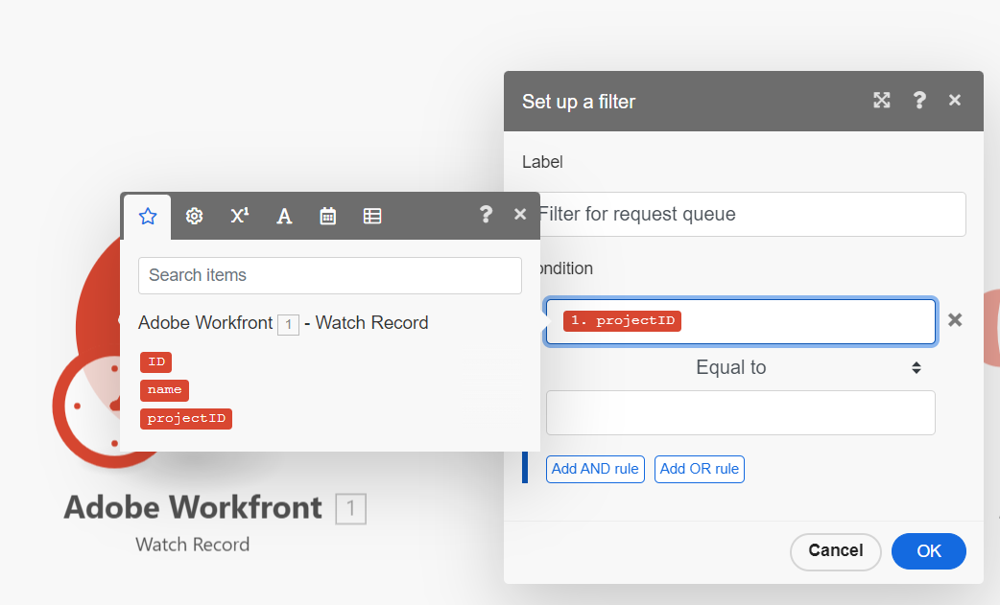

# Añadir un filtro a un escenario básico

Los filtros le permiten asegurarse de que su escenario progrese solo si se cumplen ciertas condiciones.

En este ejemplo, añadirá un filtro a su escenario que permita crear un nuevo proyecto a partir de una solicitud solo si la solicitud se envió a una cola de solicitudes específica.

Este ejemplo modifica el escenario creado en [Crear un escenario básico](/help/workfront-fusion/build-practice-scenarios/create-basic-scenario.md).

>[!NOTE]
>
>Los módulos de activación de Workfront incluyen filtros que permiten que un escenario se inicie solo si se cumplen determinadas condiciones. Sin embargo, dado que los filtros entre módulos se utilizan en todos los casos de uso que no sean de activadores ni de Workfront, es importante aprender a utilizar filtros entre módulos. Este ejemplo utiliza un filtro entre módulos para funcionalidades que podrían cumplirse con un filtro dentro del módulo.

## Requisitos de acceso

+++ Expanda para ver los requisitos de acceso para la funcionalidad en este artículo.

<table style="table-layout:auto">
 <col> 
 <col> 
 <tbody> 
  <tr> 
   <td role="rowheader">paquete de Adobe Workfront</td> 
   <td> 
Cualquier paquete de flujo de trabajo de Adobe Workfront y cualquier paquete de integración y automatización de Adobe Workfront

Workfront Ultimate

Paquetes Workfront Prime y Select, con una compra adicional de Workfront Fusion.
 </td> 
  </tr> 
  <tr data-mc-conditions=""> 
   <td role="rowheader">Licencias de Adobe Workfront</td> 
   <td> 
Estándar

Trabajo o superior
 </td> 
  </tr> 
  <tr> 
   <td role="rowheader">Producto</td> 
   <td>
   
Si su organización tiene un paquete Select o Prime Workfront que no incluye la automatización y la integración de Workfront, su organización debe adquirir Adobe Workfront Fusion.</li></ul>
   </td> 
  </tr>
 </tbody> 
</table>

Para obtener más información sobre esta tabla, consulte [Requisitos de acceso en la documentación](/help/workfront-fusion/references/licenses-and-roles/access-level-requirements-in-documentation.md).

+++

## Requisitos previos

Debe crear el escenario descrito en [Crear un escenario básico](/help/workfront-fusion/build-practice-scenarios/create-basic-scenario.md) antes de seguir este procedimiento.

## Añadir un filtro

### Preparación para añadir el filtro

1. Abra el escenario.
1. Haga clic en el primer módulo para abrirlo.
1. En el área **Salidas**, seleccione `Project`.
Ahora debería tener seleccionados `ID`, `Name` y `Project`.
1. Haga clic en Aceptar para guardar la configuración del módulo.
1. Abra Workfront.
1. En Workfront, localice el proyecto que representa la cola de solicitudes con la que trabajará el escenario de Fusion.

   Este proyecto debe estar en la misma cuenta de Workfront para la que está configurada la conexión Fusion.

1. Tome nota del ID del proyecto en la dirección URL.

   Ejemplo: https://\&lt;MyDomain\>.my.workfront.com/project/\&lt;ProjectID\>/tasks

### Adición y configuración del filtro

1. Vuelva al escenario en el editor de escenarios.
1. Haga clic en el icono de llave inglesa  entre el primer y el segundo módulo y seleccione **Configurar un filtro**.
1. En el campo Etiqueta, introduzca una etiqueta para este filtro, como “Filtro para cola de solicitudes”.
1. En el área **Condición**, en el campo superior, asigne `projectID` desde el primer módulo.

   
1. Deje el operador **Condición** como Igual a.
1. En el campo inferior del área **Condición**, pegue el identificador de proyecto del que tomó nota en la dirección URL del proyecto en [Preparación para añadir el filtro](#prepare-to-add-the-filter).
1. Haga clic en **Aceptar** para guardar la configuración del filtro.

### Prueba y activación

1. Vaya al entorno de Workfront al que se está conectando Fusion y añada un problema al proyecto que especificó en el filtro. Añadir otro problema a un proyecto diferente.
1. Haga clic en **[!UICONTROL Ejecutar una vez]** en la esquina inferior izquierda del editor de escenarios.
1. Examine el resultado para asegurarse de que el escenario se ejecutó según lo esperado.

   Ambos problemas deben aparecer en el resultado del primer módulo, pero solo el problema del proyecto especificado debe aparecer como entrada en el segundo módulo.
1. Cuando esté seguro de que el escenario funciona según lo esperado, haga clic en el conmutador **Programando** en la parte inferior izquierda de la pantalla para **activarlo**.

   Esto activará el escenario.
1. En Workfront Fusion, haga clic en **[!UICONTROL Guardar]** cerca de la esquina inferior izquierda para guardar su progreso en el escenario.

   >[!IMPORTANT]
   >
   >Se recomienda guardar con frecuencia mientras se perfeccionan y prueban escenarios.

## Recursos

* Para obtener más información sobre los filtros, consulte [Añadir un filtro a un escenario](/help/workfront-fusion/create-scenarios/add-modules/add-a-filter-to-a-scenario.md).
