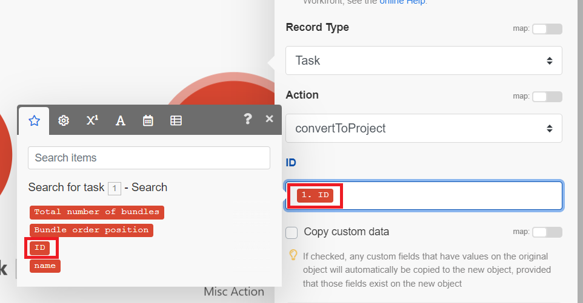

# Crear un escenario básico

La función de [!DNL Adobe Workfront Fusion] es automatizar sus procesos para que pueda concentrarse en nuevas tareas en lugar de repetir las mismas una y otra vez. Funciona vinculando acciones dentro de las aplicaciones y servicios y entre ellos para crear un escenario que transfiera y transforme los datos automáticamente. El escenario que crea ve los datos de una aplicación o servicio y los procesa para proporcionar el resultado deseado.

Este ejemplo muestra el proceso de creación de un escenario que busca una solicitud en Workfront y luego la convierte en un proyecto.

## Requisitos de acceso

+++ Expanda para ver los requisitos de acceso para la funcionalidad en este artículo.

Para utilizar la funcionalidad de este artículo debe tener el siguiente acceso:

<table style="table-layout:auto">
 <col> 
 <col> 
 <tbody> 
  <tr> 
   <td role="rowheader">[!DNL Adobe Workfront] paquete</td> 
   <td> 
Cualquiera
 </td> 
  </tr> 
  <tr data-mc-conditions=""> 
   <td role="rowheader">[!DNL Adobe Workfront] licencia</td> 
   <td> 
Nuevo: [!UICONTROL Standard]

O

Actual: [!UICONTROL Work] o superior
 </td> 
  </tr> 
  <tr> 
   <td role="rowheader">[!DNL Adobe Workfront Fusion] licencia**</td> 
   <td>
   
Actual: no se requiere licencia para [!DNL Workfront Fusion].

   
O

   
Heredado: cualquiera 

   </td> 
  </tr> 
  <tr> 
   <td role="rowheader">Producto</td> 
   <td>
   
Nuevo:
 <ul><li>[!UICONTROL Select] o plan [!UICONTROL Prime] [!DNL Workfront]: su organización debe comprar [!DNL Adobe Workfront Fusion].</li><li>[!UICONTROL Ultimate] [!DNL Workfront] plan: [!DNL Workfront Fusion] está incluido.</li></ul>
   
O

   
Actual: su organización debe comprar [!DNL Adobe Workfront Fusion].

   </td> 
  </tr>
 </tbody> 
</table>

Para obtener más información sobre esta tabla, consulte [Requisitos de acceso en la documentación](/help/workfront-fusion/references/licenses-and-roles/access-level-requirements-in-documentation.md).

Para obtener información sobre las licencias de [!DNL Adobe Workfront Fusion], consulte [[!DNL Adobe Workfront Fusion] licencias](/help/workfront-fusion/set-up-and-manage-workfront-fusion/licensing-operations-overview/license-automation-vs-integration.md).

+++

## Crear un escenario de práctica

### Empiece a crear el escenario

1. En el área **Escenarios**, haga clic en **Crear un nuevo escenario**.

   Para localizar el área de Escenarios, consulte [Navegar por Workfront Fusion](/help/workfront-fusion/get-started-with-fusion/navigate-fusion/navigate-workfront-fusion.md).

   Se mostrará el editor de escenarios, que contiene un módulo vacío en el centro.

1. Seleccione el nombre del marcador de posición **[!UICONTROL New scenario]** en la esquina superior izquierda y, a continuación, escriba un nombre.
1. Continúe con [Agregar y configurar el primer módulo](#add-and-configure-the-first-module).

### Añadir y configurar el primer módulo

1. Haga clic en el módulo vacío para elegir la aplicación desde la que seleccionará un módulo.

   A la derecha del módulo aparece una lista de aplicaciones.

1. Seleccionar **[!DNL Adobe Workfront]**. Si no está visible, haga clic en la barra de búsqueda en la parte inferior de la lista, escriba “Workfront” y selecciónela cuando aparezca en la lista.

   La lista cambia para mostrar todos los módulos de [!DNL Workfront] que puede utilizar.

1. Haga clic en el módulo **[!UICONTROL Search]**.

   Se abrirá la ventana de configuración del módulo.

1. En el cuadro [!UICONTROL Connection], seleccione la conexión de Workfront.

   Si no tiene una conexión Workfront, consulte [Crear una conexión](/help/workfront-fusion/create-scenarios/connect-to-apps/connect-to-fusion-general.md)
1. En el cuadro [!UICONTROL Record Type], seleccione **[!UICONTROL Issue]**. Esto configura el módulo para que solo busque problemas, que incluyen solicitudes.

   Puede encontrar **[!UICONTROL Issue]** en la lista si empieza a escribir la palabra &quot;[!UICONTROL Issue]&quot;.

1. En el cuadro **[!UICONTROL Result Set]**, seleccione **[!UICONTROL First Matching Record]**.

   Se configura el módulo para que devuelva únicamente el primer registro que encuentre que cumple los criterios.
1. En el área **[!UICONTROL Search criteria]**, configure los criterios para devolver la tarea específica.

   1. En el primer cuadro debajo de [!UICONTROL Search Criteria], seleccione el campo que desee incluir en la búsqueda. Para este ejemplo, seleccione **[!UICONTROL Name]**.

      Puede encontrar **[!UICONTROL Name]** en la lista si empieza a escribir la palabra &quot;[!UICONTROL name]&quot;.
   1. Para el operador, haga clic en la flecha desplegable junto a **Existe** y cambie a [!UICONTROL **Contiene (sin distinción de mayúsculas y minúsculas)**].

      Esto permite que el módulo encuentre proyectos con las palabras que elija en el nombre, incluso si no introduce el nombre completo o si introduce el nombre con mayúsculas o minúsculas incorrectas (como, por ejemplo, todo mayúsculas).
   1. En el último campo debajo de [!UICONTROL Search Criteria], escriba una palabra o frase que sepa que está en el nombre de la tarea que está buscando.

1. En la lista **[!UICONTROL Outputs]**, seleccione los campos que desea que el módulo muestre. Para este ejemplo, seleccione los campos **[!UICONTROL ID]** y **[!UICONTROL Name]**.

   >[!TIP]
   >
   >Puede usar **Cmd+F** ([!DNL Mac] OS) o **Ctrl-F** ([!DNL Windows] OS) para encontrar un campo rápidamente.

1. Haga clic en **[!UICONTROL OK]** para guardar la configuración del módulo.

1. Haga clic con el botón secundario en el módulo, haga clic en **[!UICONTROL Rename]**, escriba un nombre y describa lo que desea que haga el módulo (como &quot;Buscar solicitudes&quot;) y, a continuación, haga clic en **[!UICONTROL OK]**.

   El nombre aparece justo debajo del módulo. Debajo de eso, [!DNL Workfront Fusion] incluye una breve descripción del tipo de acción realizada por el módulo.

   

1. Continúe con [Añadir y configurar el segundo módulo](#add-and-configure-the-second-module).

## Añadir y configurar el segundo módulo

1. Pase el ratón sobre el círculo parcial a la derecha del del módulo y luego haga clic en **[!UICONTROL Add another module]**.
1. Seleccione [!DNL Adobe Workfront] de la lista de aplicaciones y luego elija el módulo **[!UICONTROL Convert object]**.
1. En el campo [!UICONTROL Connection], seleccione la misma conexión de Workfront que utilizó en el módulo anterior
1. En el campo **[!UICONTROL Record type]**, seleccione **[!UICONTROL issue]**, ya que el módulo convertirá un problema.
1. En el campo **[!UICONTROL Convert to]**, seleccione **Proyecto**.
1. Junto al campo Identificador de tarea, haga clic en el conmutador de asignación para habilitarlo.

   El conmutador se vuelve azul cuando está habilitado. Esto le permite asignar el Identificador de tarea del módulo anterior.

   
1. Haga clic en el campo **[!UICONTROL Task ID]**.

   Se abre un panel que le permite seleccionar qué utilizar como identificador de la tarea que desea convertir en proyecto. Dado que ha habilitado la asignación, el panel incluye la salida de cualquier módulo anterior. Ha seleccionado ID como salida del módulo anterior, por lo que ahora está disponible en el panel.

   Este panel se denomina panel de asignación. Para obtener más información sobre el panel de asignación, consulte [Descripción general de asignación](/help/workfront-fusion/get-started-with-fusion/understand-fusion/mapping-overview.md).
1. Seleccione **ID** en el panel de asignación.

   Aparece un bloque de ID en el campo ID. Muestra el número del módulo desde el que se asigna y el campo que se asigna.

   

1. Haga clic en el campo **Identificador de plantilla**, empiece a escribir el nombre de la plantilla de Workfront que desea utilizar para este proyecto y, a continuación, selecciónela cuando aparezca en la lista.
1. Haga clic en **[!UICONTROL OK]** para guardar la configuración del módulo.

1. Haga clic con el botón secundario en el módulo, haga clic en **[!UICONTROL Rename]**, escriba un nombre y describa lo que desea que haga el módulo (como &quot;Convertir en proyecto&quot;) y, a continuación, haga clic en **[!UICONTROL OK]**.

1. Continuar para [Probar el escenario](#test-the-scenario).

## Probar el escenario

Antes de activar el escenario, es importante probarlo ejecutándolo al menos una vez y viendo los resultados. Esto le ayuda a comprender cómo fluyen los datos a través del escenario y a encontrar cualquier error.

En este caso, una prueba que se realice correctamente buscaría la solicitud y la convertiría en un proyecto.

1. Haga clic en **[!UICONTROL Run once]** en la esquina inferior izquierda del editor de escenarios.
1. Una vez que el escenario termine de ejecutarse, haga clic en la burbuja situada encima del primer módulo para poder ver información sobre el paquete de datos que procesó el módulo, incluidos los datos extraídos de la solicitud que devolvió el módulo.

1. Haga clic en la burbuja del inspector de ejecución situada encima del segundo módulo para ver la entrada (la solicitud) y la salida (el proyecto convertido).

   Para obtener más información sobre los datos de las burbujas de inspección, consulte lo siguiente:

   * Para obtener información general, consulte [Flujo de ejecución de escenario](/help/workfront-fusion/references/scenarios/scenario-execution-flow.md).
   * Para obtener información acerca de los paquetes procesados, vea [Ejecución de escenarios, ciclos y fases](/help/workfront-fusion/references/scenarios/scenario-execution-cycles-phases.md).

1. En [!DNL Workfront Fusion], haga clic en **[!UICONTROL Save]** cerca de la esquina inferior izquierda para guardar su progreso en el escenario.

   >[!IMPORTANT]
   >
   >Se recomienda guardar con frecuencia mientras se perfeccionan y prueban escenarios.

>[!TIP]
>
>Recomendamos la práctica opcional pero útil de añadir notas sobre cada módulo.
>
>1. Haga clic con el botón derecho en un módulo y luego seleccione **[!UICONTROL Add a note]**.
>1. En la nota que se muestra, escriba una descripción general del módulo.
>
>    Puede añadir varias notas para un módulo.
>
>1. Cierre el área **[!UICONTROL Notes]**.
>
>     Después de agregar una nota a un escenario, aparece un punto naranja en el icono **[!UICONTROL Notes]**  en la parte inferior del editor de escenarios.
>
>1. Haga clic en el icono **[!UICONTROL Notes]**  para ver las notas.
>

## Activar el escenario

El último paso para crear un escenario es activarlo.

Dado que este escenario busca un problema específico, no es necesario activarlo. La activación de un escenario hace que se ejecute en una programación o cuando se produce una acción específica en una aplicación. Después de activar un escenario, de forma predeterminada, se ejecuta cada 15 minutos. Puede cambiar esto definiendo cuándo y con qué frecuencia desea que se ejecute.

Para obtener más información sobre cómo activar escenarios, vea [Activar o desactivar un escenario](/help/workfront-fusion/manage-scenarios/activate-deactivate-scenarios.md).

Para obtener información sobre las programaciones, consulte [Programar un escenario](/help/workfront-fusion/create-scenarios/config-scenarios-settings/schedule-a-scenario.md).

## Pasos siguientes

* [Añada un módulo de activador](/help/workfront-fusion/build-practice-scenarios/add-a-webhook-to-basic-scenario.md) para permitir que el escenario busque periódicamente nuevas solicitudes y las convierta en proyectos.
* [Agregue un gancho web](/help/workfront-fusion/build-practice-scenarios/add-a-webhook-to-basic-scenario.md) para permitir que el escenario se ejecute cada vez que se ingrese una solicitud.
* [Agregue un filtro](/help/workfront-fusion/build-practice-scenarios/add-filter-basic-scenario.md) para asegurarse de que solo determinadas solicitudes se conviertan en proyectos.
* [Agregue una función](/help/workfront-fusion/build-practice-scenarios/use-function-to-build-practice-scenario.md) que personalice el nombre del nuevo proyecto.
