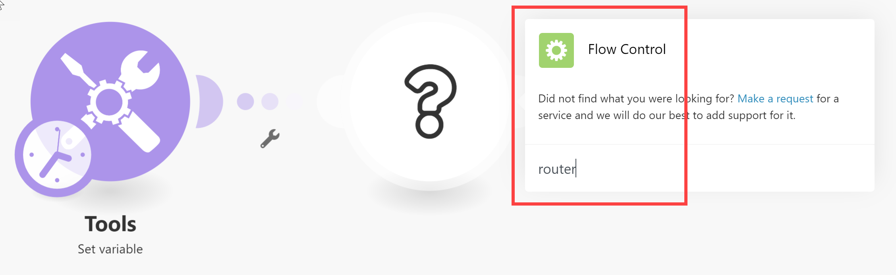

# Añadir un módulo de enrutador y configurar rutas

El módulo Enrutador le permite bifurcar el escenario en varias rutas y procesar los datos de cada ruta de forma diferente. Cuando un módulo Enrutador recibe un paquete, lo reenvía a cada ruta conectada en el orden en que se adjuntaron las rutas al módulo Enrutador.

Las rutas se procesan secuencialmente, no en paralelo. No se envía un paquete a la siguiente ruta hasta que la ruta anterior lo haya procesado completamente.

## Requisitos de acceso

+++ Expanda para ver los requisitos de acceso para la funcionalidad en este artículo.

<table style="table-layout:auto">
 <col> 
 <col> 
 <tbody> 
  <tr> 
   <td role="rowheader">Paquete de Adobe Workfront</td> 
   <td> 
Cualquier paquete del flujo de trabajo de Adobe Workfront y cualquier paquete de integración y automatización de Adobe Workfront

Workfront Ultimate

Paquetes Workfront Prime y Select, con una compra adicional de Workfront Fusion.
 </td> 
  </tr> 
  <tr data-mc-conditions=""> 
   <td role="rowheader">Licencias de Adobe Workfront</td> 
   <td> 
Estándar

Trabajo o superior
 </td> 
  </tr> 
  <tr> 
   <td role="rowheader">Producto</td> 
   <td>
   
Si su organización tiene un paquete de Workfront Select o Prime que no incluye la automatización y la integración de Workfront, su organización debe adquirir Adobe Workfront Fusion.</li></ul>
   </td> 
  </tr>
 </tbody> 
</table>

Para obtener más información sobre el contenido de esta tabla, consulte los [Requisitos de acceso en la documentación](/help/workfront-fusion/references/licenses-and-roles/access-level-requirements-in-documentation.md).

+++

## Agregar un módulo Enrutador a un escenario

Debe agregar un módulo Enrutador antes de configurar las rutas.

1. Haga clic en la ficha **[!UICONTROL Escenarios]** en el panel izquierdo.
1. Seleccione el escenario en el que desea agregar un enrutador.
1. Haga clic en cualquier lugar del escenario para introducir el Editor de escenarios.
1. En el editor de escenarios, haga clic en el controlador derecho del módulo después del cual desea agregar el enrutador y, a continuación, seleccione **[!UICONTROL Control de flujo]** > **Enrutador** en la lista de módulos que se muestra.

   

   O

   Para insertar el módulo Enrutador entre dos módulos, haz clic en el icono de la llave inglesa debajo de la ruta que conecta los dos módulos y selecciona **[!UICONTROL Agregar un enrutador]** del menú.

   
1. Agregue la primera ruta al enrutador haciendo clic en el controlador derecho del enrutador y agregando un módulo, de forma similar a agregar cualquier módulo.
1. Para agregar otra ruta, haga clic en el módulo enrutador. Aparecerá una ruta. Agregue módulos a esta ruta según desee.

   Puede agregar todas las rutas que desee.

1. Para verificar el orden de las rutas, compruebe la etiqueta de cada ruta. La Ruta 1 se ejecuta primero, luego la Ruta 2, etc.

   O

   Haga clic en el icono de alineación automática .

   Las rutas se organizan en el orden en que se ejecutan. La ruta superior se ejecuta primero.

1. (Opcional) Para cambiar el orden de las rutas, haga clic con el botón derecho en el módulo Enrutador y seleccione **Ordenar rutas** Arrastre y suelte las rutas en el orden en que desee que se ejecuten. Las rutas están marcadas por el primer módulo que sigue al enrutador (el primer módulo de la ruta).

   

1. (Opcional) Para deshabilitar una ruta, haga clic con el botón secundario en los puntos que llevan del enrutador a esa ruta y seleccione **Deshabilitar ruta**.

   Las rutas deshabilitadas muestran puntos grises que llevan del enrutador al primer módulo de la ruta y muestran el icono de ruta deshabilitada  en la etiqueta.

1. (Opcional y condicional) Para habilitar una ruta deshabilitada, haga clic en el icono de ruta deshabilitada  en la etiqueta de la ruta.
1. Continuar a [Agregar un filtro a una ruta](#add-a-filter-to-a-route).

## Adición de un filtro a una ruta

Puede colocar un filtro en una ruta después del módulo Enrutador para filtrar paquetes. Solo los paquetes que pasen a través del filtro serán administrados por los módulos en la ruta.

Si los datos pasan el filtro de más de una ruta, los datos se gestionan mediante ambas rutas. La ruta superior gestiona primero los datos.

Los enrutadores con filtros muestran el icono de filtro  en la etiqueta de ruta.

1. Haga clic en la ficha **[!UICONTROL Escenarios]** en el panel izquierdo.
1. Seleccione el escenario en el que desea agregar un filtro.
1. Haga clic en cualquier lugar del escenario para introducir el Editor de escenarios.
1. Haga clic en el icono de llave inglesa  en la ruta donde desee establecer un filtro. Es la ruta entre el módulo de enrutador y el primer módulo de la ruta.
1. Seleccione **Configurar un filtro.**
1. En el campo de etiqueta del panel que se muestra, agregue una etiqueta. Esta etiqueta se muestra en el escenario.
1. Configure las condiciones de filtro.

   Para obtener más información, consulte [Añadir un filtro a un escenario](/help/workfront-fusion/create-scenarios/add-modules/add-a-filter-to-a-scenario.md).

1. Haga clic en **[!UICONTROL Aceptar]** para guardar la configuración del filtro.
1. (Condicional) Si el nombre del filtro es demasiado largo para que quepa en la etiqueta, pase el ratón sobre la etiqueta para mostrar el nombre completo.

1. Continuar a [Configurar una ruta de reserva](#configure-a-fallback-route).

## Configuración de una ruta de reserva

La ruta de reserva es la ruta que se ejecuta en cualquier paquete que no pase ningún filtro a otra ruta.

Las rutas de reserva muestran &quot;Reserva&quot; en la etiqueta.

Puede habilitar una ruta de reserva en el panel de filtros.

1. Haga clic en la ficha **[!UICONTROL Escenarios]** en el panel izquierdo.
1. Seleccione el escenario en el que desea agregar una ruta de reserva.
1. Haga clic en cualquier lugar del escenario para introducir el Editor de escenarios.
1. Haga clic en el icono de llave inglesa  en la ruta donde desee establecer un filtro. Es la ruta entre el módulo de enrutador y el primer módulo de la ruta.
1. Seleccione **Configurar un filtro.**
1. En el campo de etiqueta del panel que se muestra, agregue una etiqueta. Esta etiqueta se muestra en el escenario.
1. Active la casilla de verificación Ruta de reserva.

   

1. Haga clic en **[!UICONTROL Aceptar]** para guardar la configuración del filtro.

La ruta de reserva se marca con una flecha diferente en el módulo Enrutador:

## Ejemplo: caso de uso `if/else`

>[!BEGINSHADEBOX]

Un caso de uso típico de la ruta de reserva es continuar el flujo con una ruta si se cumple la condición y con otra ruta si no lo es. como en los pasos siguientes:

En este ejemplo, la primera ruta se configura con un filtro. Representa el componente `if`.

La segunda ruta se configura como una ruta de reserva. Representa el componente `else`.

>[!ENDSHADEBOX]
