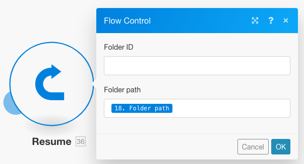

# Añadir filtrado y anidamiento a las rutas de gestión de errores

Puede añadir técnicas avanzadas de gestión de errores a la ruta de gestión de errores incluyendo el filtrado y el anidamiento.

## Requisitos de acceso

+++ Expanda para ver los requisitos de acceso para la funcionalidad en este artículo.

Para utilizar la funcionalidad de este artículo debe tener el siguiente acceso:

<table style="table-layout:auto">
 <col> 
 <col> 
 <tbody> 
  <tr> 
   <td role="rowheader">paquete de Adobe Workfront 
   <td> 
Cualquiera
 </td> 
  </tr> 
  <tr data-mc-conditions=""> 
   <td role="rowheader">Licencia de Adobe Workfront</td> 
   <td> 
Nuevo: estándar

O

Actual: Trabajo o superior
 </td> 
  </tr> 
  <tr> 
   <td role="rowheader">Licencia de Adobe Workfront Fusion**</td> 
   <td>
   
Actual: no se requiere licencia de Workfront Fusion.

   
O

   
Heredado: cualquiera 

   </td> 
  </tr> 
  <tr> 
   <td role="rowheader">Producto</td> 
   <td>
   
Nuevo:
 <ul><li>Plan Select or Prime Workfront: su organización debe adquirir Adobe Workfront Fusion.</li><li>Plan Ultimate Workfront: Workfront Fusion está incluido.</li></ul>
   
O

   
Actual: Su organización debe adquirir Adobe Workfront Fusion.

   </td> 
  </tr>
 </tbody> 
</table>

Para obtener más información sobre esta tabla, consulte [Requisitos de acceso en la documentación](/help/workfront-fusion/references/licenses-and-roles/access-level-requirements-in-documentation.md).

Para obtener información sobre las licencias de Adobe Workfront Fusion, consulte [licencias de Adobe Workfront Fusion](/help/workfront-fusion/set-up-and-manage-workfront-fusion/licensing-operations-overview/license-automation-vs-integration.md).

+++

## Filtrando

Hay dos tipos de filtrado que pueden tener lugar en una ruta del controlador de errores.

* [Añadir un filtro a la ruta del controlador de error](#add-a-filter-to-the-error-handler-route)
* [Agregar un enrutador seguido de filtros a la ruta del controlador de errores](#add-a-router-followed-by-filters-to-the-error-handler)

### Añadir un filtro a la ruta del controlador de error

Puede utilizar un filtro para controlar qué errores gestiona la ruta del controlador de errores. Esto le permite procesar solamente tipos específicos de errores. Si un error no pasa el filtro, se tratará como si no hubiera ninguna ruta del controlador de errores definida para el módulo dado.

Estos filtros están configurados como cualquier otro filtro en Fusion. Para obtener instrucciones, vea [Agregar un filtro a un escenario](/help/workfront-fusion/create-scenarios/add-modules/add-a-filter-to-a-scenario.md).

### Agregar un enrutador seguido de filtros al controlador de errores

Agregar un enrutador a una ruta de control de errores permite configurar diferentes rutas para distintos tipos de errores.

Por ejemplo, para configurar una ruta que se ejecutará cuando el error sea un DataError, puede configurar un filtro que permita que los datos pasen si el tipo de error asignado es igual a DataError.

Para obtener información sobre cómo Fusion evalúa y procesa varios tipos de datos, consulte [Tipos de error](/help/workfront-fusion/references/errors/error-processing.md).

### Ejemplo: Control de errores con filtros

>[!BEGINSHADEBOX]

Este escenario de ejemplo muestra cómo funcionan estos filtros para la administración de errores.

Si utiliza el módulo Dropbox > Crear una carpeta y ya existe una carpeta con el mismo nombre, el módulo genera un error de datos:

El escenario completo funciona de la siguiente manera:

1. El módulo Herramientas > Establecer variable contiene el nombre de la carpeta
1. El módulo HTTP > Obtener un archivo obtiene el archivo que debe cargarse en la carpeta
1. El módulo Dropbox > Crear una carpeta genera un error si ya existe una carpeta con el mismo nombre que la asignada en el módulo
1. La ruta del controlador de errores (burbujas transparentes) contiene un enrutador para filtrar los errores
La primera ruta es para un tipo de error especificado denominado `DataError`.

   1. Si se produce un `DataError` y los detalles del error pasan a través del filtro, el Dropbox >Enumerar todos los archivos/subcarpetas en un módulo de carpetas enumera todas las carpetas en el Dropbox.
   1. El filtro siguiente coincide con los nombres de carpeta.
   1. La directiva **Resume** especifica el ID de carpeta y la ruta de acceso de la carpeta existente, y la ejecución del escenario se reanuda desde el módulo Dropbox > Crear una carpeta. Sin embargo, en lugar de crear una carpeta nueva, Fusion utiliza los valores de la directiva Resume para pasar al siguiente módulo y cargar el archivo en la carpeta existente.

1. La segunda ruta es para todos los demás errores y termina con la directiva Rollback, lo que resulta en detener el escenario inmediatamente

A continuación se muestra una explicación detallada de la ruta DataError.

Para utilizar la carpeta existente en los módulos posteriores, como Upload a file, debe añadir una ruta de controlador de error al módulo y recuperar la ruta de la carpeta que se va a asignar al módulo de directiva Resume que sigue:

El filtro de la primera ruta está configurado para controlar únicamente el error concreto (DataError) que aparece cuando ya existe una carpeta con el mismo nombre:

El Dropbox > List all files in a folder module está configurado para devolver todas las carpetas de la carpeta de destino. El siguiente filtro solo pasa el que estábamos intentando crear originalmente. (El nombre de la carpeta se almacena en el 33. Elemento Nombre de carpeta.)

A continuación, la directiva Resume proporciona la ruta Folder como salida para el módulo con error. Tenga en cuenta que el ID de carpeta se ha dejado en blanco, ya que el módulo Cargar un archivo no lo necesita.

>[!ENDSHADEBOX]

## Anidado

Las rutas de controladores de errores se pueden crear y configurar en todos los módulos, excepto en los enrutadores. Por lo tanto, puede crear una ruta de controladores de errores para un módulo que ya forme parte de una ruta de controladores de errores existente.

>[!BEGINSHADEBOX]

Ejemplo:

Una ruta de controladores de error anidada con filtros:

En este escenario, la segunda ruta del controlador de errores está anidada en la primera ruta del controlador de errores.

Si el módulo Dropbox > Crear una carpeta encuentra un error, la ejecución se mueve a la primera ruta. Si se pasa el filtro `DataError Takes Place`, se ejecuta el siguiente módulo, seguido del módulo de directiva Resume si no se produce un error en el Dropbox > Enumerar todos los archivos/subcarpetas de un módulo de carpetas.

Sin embargo, si se produce un error en el Dropbox > Enumerar todos los archivos/subcarpetas de un módulo de carpetas, la ejecución se mueve a la Ruta 2 del controlador de errores y finaliza con la directiva [!UICONTROL Ignore]. El módulo [!UICONTROL Resume directive] no se ejecuta en este caso.

>[!ENDSHADEBOX]
