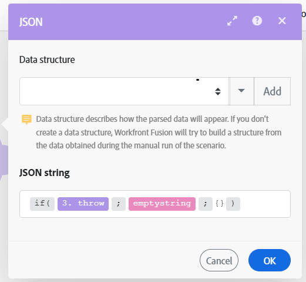

# Solución alternativa al error `throw`

En algunos casos, es posible que desee detener a la fuerza la ejecución del escenario seguida de la fase Rollback o Commit, o detener el procesamiento de una ruta y, opcionalmente, almacenarla en la cola de ejecuciones incompletas.

En la actualidad, las directivas de gestión de errores no se pueden utilizar fuera del ámbito de una ruta de gestión de errores y Adobe Workfront Fusion no ofrece un módulo que le permita generar (arrojar) errores de forma fácil y condicional.

Puede utilizar la siguiente solución para imitar la funcionalidad de error `throw`.

Para obtener información sobre las ejecuciones incompletas, consulte [Ver y resolver ejecuciones incompletas en Adobe Workfront Fusion](/help/workfront-fusion/manage-scenarios/view-and-resolve-incomplete-executions.md).

Para obtener información sobre las directivas de gestión de errores, consulte [Directivas para la gestión de errores en Adobe Workfront Fusion](/help/workfront-fusion/references/errors/directives-for-error-handling.md).

## Requisitos de acceso

+++ Expanda para ver los requisitos de acceso para la funcionalidad en este artículo.

<table style="table-layout:auto">
 <col> 
 <col> 
 <tbody> 
  <tr> 
   <td role="rowheader">Paquete de Adobe Workfront</td> 
   <td> 
Cualquier paquete del flujo de trabajo de Adobe Workfront y cualquier paquete de integración y automatización de Adobe Workfront

Workfront Ultimate

Paquetes Workfront Prime y Select, con una compra adicional de Workfront Fusion.
 </td> 
  </tr> 
  <tr data-mc-conditions=""> 
   <td role="rowheader">Licencias de Adobe Workfront</td> 
   <td> 
Estándar

Trabajo o superior
 </td> 
  </tr> 
  <tr> 
   <td role="rowheader">Producto</td> 
   <td>
   
Si su organización tiene un paquete de Workfront Select o Prime que no incluye la automatización y la integración de Workfront, su organización debe adquirir Adobe Workfront Fusion.</li></ul>
   </td> 
  </tr>
 </tbody> 
</table>

Para obtener más información sobre el contenido de esta tabla, consulte [Requisitos de acceso en la documentación](/help/workfront-fusion/references/licenses-and-roles/access-level-requirements-in-documentation.md).

+++

## Solución alternativa para `throw`

Para generar un error de forma condicional, puede configurar un módulo para que falle a propósito durante su funcionamiento. Una posibilidad es emplear el módulo [!UICONTROL JSON] > [!UICONTROL Analizar JSON], configurado para generar opcionalmente un error (`BundleValidationError` en este caso):

A continuación, puede adjuntar una de las directivas de gestión de errores a la ruta de gestión de errores:

* **Reversión**: Fuerza la ejecución del escenario para que se detenga y realice la fase de reversión.
* **Compromiso**: Fuerza la ejecución del escenario para que se detenga y realice la fase de confirmación.
* **Ignorar**: detiene el procesamiento de una ruta.
* **Descanso**: detiene el procesamiento de una ruta y la almacena en la cola de la carpeta de ejecuciones incompletas.

El ejemplo siguiente muestra el uso de la directiva [!DNL Rollback]:

