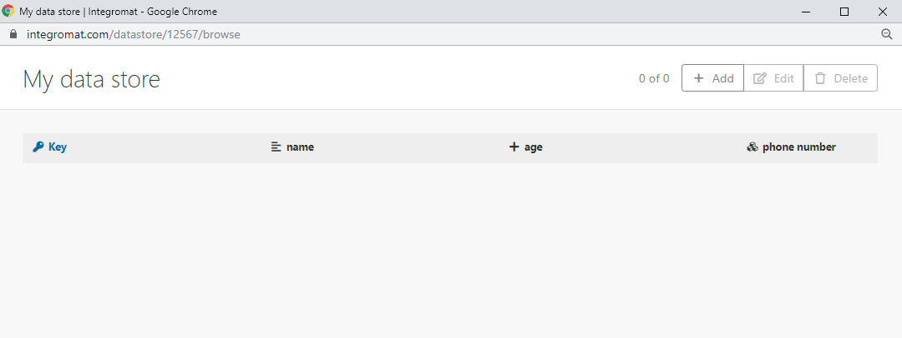

# Creación y administración de almacenes de datos

Un almacén de datos, similar a una base de datos o tabla simple, puede almacenar datos de escenarios, lo que permite transferir datos entre escenarios individuales o ejecuciones de escenarios. Puede utilizar un almacén de datos para almacenar nuevos datos de varios sistemas durante la sincronización.

Los módulos del almacén de datos permiten realizar las siguientes acciones en los registros de su almacén de datos de Adobe Workfront Fusion:

* Agregar
* Reemplazar
* Actualizar
* Recuperar
* Eliminar
* Buscar
* Cuenta

Para obtener información sobre el uso de módulos de almacén de datos, consulte [[!UICONTROL Módulos del almacén de datos]](/help/workfront-fusion/references/apps-and-modules/tools-and-transformers/data-store-modules.md).

Para ver un vídeo introductorio a los almacenes de datos en Workfront Fusion, consulte:

* [Almacenes de datos](https://video.tv.adobe.com/v/3427029/){target=_blank}

## Requisitos de acceso

+++ Expanda para ver los requisitos de acceso para la funcionalidad en este artículo.

<table style="table-layout:auto">
 <col> 
 <col> 
 <tbody> 
  <tr> 
   <td role="rowheader">paquete de Adobe Workfront</td> 
   <td> 
Cualquier paquete de flujo de trabajo de Adobe Workfront y cualquier paquete de integración y automatización de Adobe Workfront

Workfront Ultimate

Paquetes Workfront Prime y Select, con una compra adicional de Workfront Fusion.
 </td> 
  </tr> 
  <tr data-mc-conditions=""> 
   <td role="rowheader">Licencias de Adobe Workfront</td> 
   <td> 
Estándar

Trabajo o superior
 </td> 
  </tr> 
  <tr> 
   <td role="rowheader">Producto</td> 
   <td>
   
Si su organización tiene un paquete Select o Prime Workfront que no incluye la automatización y la integración de Workfront, su organización debe adquirir Adobe Workfront Fusion.</li></ul>
   </td> 
  </tr>
 </tbody> 
</table>

Para obtener más información sobre esta tabla, consulte [Requisitos de acceso en la documentación](/help/workfront-fusion/references/licenses-and-roles/access-level-requirements-in-documentation.md).

+++

## Espacio de datos disponible

Si su organización está en el nuevo modelo de plan de Workfront (paquetes Select, Prime y Ultimate), el plan de su organización afecta al tamaño y el número de almacenes de datos disponibles en su instancia de Fusion.

### plan de Ultimate

Las instancias de Fusion del paquete de Ultimate reciben:

* 100 MB de espacio
* 50 almacenes de datos

### Seleccionar y Prime planes

Las instancias de Fusion en los paquetes Select o Prime reciben :-->

* 100 MB para las primeras 500K operaciones.

* 10 MB por cada operación adicional de 100.000.

  Por ejemplo, una organización con 600 000 operaciones recibe 110 MB.

Cada equipo de su organización puede tener hasta 50 almacenes de datos. El tamaño combinado de estos almacenes de datos no puede superar el tamaño total del almacén de datos de su organización.

## Creación de un almacén de datos en Workfront Fusion

* [Configuración del almacén de datos](#set-up-the-data-store)
* [Configuración de la estructura de datos](#set-up-the-data-structure)

### Configuración del almacén de datos

Para poder utilizar un almacén de datos en un módulo, debe crear el almacén de datos en Workfront Fusion.

>[!NOTE]
>
>Su organización tiene un número limitado de almacenes de datos disponibles. Si intenta crear más almacenes de datos de los que tiene disponibles, Workfront devolverá un error [!UICONTROL Se alcanzó el número máximo de almacenes].
>
>Para obtener más información, consulte [Error alcanzado en el número máximo de tiendas](#maximum-stores-reached-error) en este artículo.

1. Inicie sesión en su cuenta de Workfront Fusion.
1. Haga clic en **[!UICONTROL Almacenes de datos]** en el panel de navegación izquierdo.
1. Haga clic en **[!UICONTROL Agregar almacén de datos]** en la esquina superior derecha de la pantalla.
1. Introduzca la configuración del nuevo almacén de datos.

   Un título en negrita en un campo de un módulo de Workfront Fusion indica que se requiere una configuración.

   <table style="table-layout:auto">
    <col> 
    <col> 
    <tbody> 
     <tr> 
      <td>[!UICONTROL Nombre del almacén de datos] </td> 
      <td> 
Escriba un nombre para el almacén de datos. 
 </td> 
     </tr> 
     <tr> 
      <td> 
[!UICONTROL Data Structure]
 </td> 
      <td> 
Una estructura de datos es una lista de las columnas de una tabla. Esta lista indica el nombre de columna y el tipo de datos.
 
Realice una de las siguientes acciones:
 
       <ul> 
        <li><b>Seleccione una estructura de datos que ya se haya creado</b></li> 
        <li><b>Agregar nueva estructura de datos</b> 
Haga clic en <strong>[!UICONTROL Agregar]</strong> para crear una nueva estructura de datos.
 
Para obtener más información, consulte la sección <a href="#set-up-the-data-structure" class="MCXref xref">Configurar la estructura de datos</a> en este artículo.
 </li> 
        <li style="font-weight: bold;"> 
Deje el campo vacío.
 
Si no selecciona ni añade una estructura de datos, la base de datos solo contendrá la clave principal. Este tipo de base de datos es útil si sólo desea guardar claves y sólo le interesa saber si existe o no una clave específica en la base de datos.
 </li> 
       </ul> </td> 
     </tr> 
     <tr> 
      <td>Tamaño de almacenamiento de datos en MB</td> 
      <td> 
Asigne el tamaño del almacén de datos desde el almacenamiento de datos interno total.
 
 El valor predeterminado es 10 MB. Si tiene menos de 10 MB de espacio de almacén de datos sin asignar de su asignación de 95 MB, el tamaño predeterminado es la cantidad de almacenamiento sin asignar.  
Nota: El importe reservado se puede cambiar en cualquier momento.
  </td> 
     </tr> 
    </tbody> 
   </table>

### Configuración de la estructura de datos

1. Al crear o editar un almacén de datos, haga clic en **[!UICONTROL Agregar]**.
1. En el cuadro **[!UICONTROL Agregar estructura de datos]** que aparece, configure los campos siguientes:

   <table style="table-layout:auto">
    <col> 
    <col> 
    <tbody> 
     <tr> 
      <td>[!UICONTROL Nombre de estructura de datos]</td> 
      <td> 
 Introduzca un nombre para la nueva estructura de datos.
 </td> 
     </tr> 
     <tr> 
      <td> 
[!UICONTROL Especificación]
 </td> 
      <td> 
Realice una de las siguientes acciones para configurar las columnas del almacén de datos.
 
       <ul> 
        <li> 
Haga clic en <strong>[!UICONTROL Agregar elemento]</strong> para especificar manualmente las propiedades de una columna.
 
Escriba <strong>[!UICONTROL Name]</strong> y <strong>[!UICONTROL Type]</strong> para la columna del almacén de datos y defina las propiedades correspondientes.
 </li> 
        <li> 
Haga clic en <strong>[!UICONTROL Generator]</strong> para determinar las columnas a partir de los datos de ejemplo proporcionados.
 
         
Example: </b>">
          <b>Ejemplo:</b> 
          
Por ejemplo, los siguientes datos de ejemplo de JSON crean tres columnas: nombre, edad y número de teléfono. Número de teléfono es una colección de números de teléfono móviles y de teléfono fijo.
 
          
<code>&lbrace;</code> 
 
          
<code>"name":"John",</code> 
 
          
<code>"age":30,</code> 
 
          
<code>"phone number": &lbrace;</code> 
 
          
<code>"mobile":"987654321",</code> 
 
          
<code>"landline":"123456789"</code> 
 
          
<code>&rbrace;</code> 
 
          
<code>&rbrace;</code> 
 
          
Las columnas vacías en la vista del almacén de datos:
 
          
  
 
          
Puede añadir valores al almacén de datos manualmente o mediante los módulos del almacén de datos de Workfront Fusion.
 
         
 </li> 
       </ul> </td> 
     </tr> 
     <tr> 
      <td>[!UICONTROL Estricto] </td> 
      <td> 
Active esta opción para asegurarse de que la carga útil coincida con las estructuras de datos. Se rechazarán las cargas que contengan elementos adicionales no especificados en la estructura de datos.
 </td> 
     </tr> 
    </tbody> 
   </table>

## Editar un almacén de datos existente

Puede editar las propiedades y el contenido de un almacén de datos existente en el área de [!UICONTROL Almacenes de datos] de Workfront Fusion.

* [Editar las propiedades de un almacén de datos](#edit-the-properties-of-a-data-store)
* [Editar el contenido de un almacén de datos](#edit-the-contents-of-a-data-store)

### Editar las propiedades de un almacén de datos

Las propiedades de un almacén de datos incluyen la estructura de datos que utiliza el almacén de datos, así como el tamaño de éste.

1. Haga clic en **[!UICONTROL Almacenes de datos]**  en el panel de navegación izquierdo para abrir el área de [!UICONTROL Almacenes de datos].
1. Haga clic en **[!UICONTROL Editar]**  junto al almacén de datos que desee editar.
1. (Opcional) Si desea cambiar la estructura de datos utilizada por este almacén de datos a otra estructura de datos existente, selecciónela en la lista desplegable **[!UICONTROL Estructura de datos]**.

   O

   (Opcional) Si desea cambiar la estructura de datos usada por este almacén de datos a una estructura de datos completamente nueva, consulte [Configurar la estructura de datos](#set-up-the-data-structure) en este artículo.

1. (Opcional) Cambie el tamaño del almacén de datos introduciendo el nuevo tamaño en el campo **[!UICONTROL Tamaño de almacenamiento de datos en MB]**.
1. Haga clic en **[!UICONTROL Guardar]**.

### Editar el contenido de un almacén de datos

1. Haga clic en el icono **[!UICONTROL Almacén de datos]**  en el panel de navegación izquierdo para abrir el área [!UICONTROL Almacén de datos].
1. Haga clic en **[!UICONTROL Examinar]** junto al almacén de datos que desea editar.
1. (Opcional) Reordene las columnas arrastrándolas a la ubicación deseada.
1. (Opcional) [!UICONTROL Edite] una sola celda haciendo clic en el icono **[!UICONTROL Editar]** de esa celda y, a continuación, introduciendo el valor deseado.
1. (Opcional) Agregue un nuevo elemento al almacén de datos haciendo clic en **[!UICONTROL Agregar]** y, a continuación, escribiendo la información del nuevo elemento.
1. Haga clic en **[!UICONTROL Guardar]**.

## Resolución de problemas

* [Restauración de datos perdidos de un almacén de datos](#restoring-lost-data-from-a-data-store)
* [Error de falta de espacio](#out-of-space-error)
* [Error de número máximo de tiendas alcanzado](#maximum-stores-reached-error)

### Restauración de datos perdidos de un almacén de datos

Actualmente no hay ninguna herramienta que pueda automatizar la restauración de los datos perdidos.

#### Solución

1. Examine todos los registros de ejecución de escenarios en los que se insertaron elementos en el almacén de datos.

   Para obtener más información sobre cómo examinar los registros de ejecución, vea [Ver el historial de ejecución de un escenario](/help/workfront-fusion/manage-scenarios/view-scenario-execution-history.md).

1. Copie los datos.
1. Vuelva a insertar los datos en el almacén de datos.

   Para obtener información sobre cómo insertar datos en un almacén de datos, consulte [Editar el contenido de un almacén de datos](#edit-the-contents-of-a-data-store) en este artículo.

### Error de [!UICONTROL espacio insuficiente]

Se produce un error de [!UICONTROL espacio insuficiente] porque ya se ha asignado el almacenamiento del almacén de datos asignado a los almacenes de datos creados anteriormente.

#### Solución

1. Edite cualquiera de los almacenes de datos existentes para utilizar menos espacio. Esto libera espacio para el nuevo almacén de datos.

   Para obtener más información, consulte [Editar las propiedades de un almacén de datos](#edit-the-properties-of-a-data-store) en este artículo.

>[!NOTE]
>
>Le recomendamos que no asigne todo su espacio a un único almacén de datos a menos que esté seguro de que no necesitará más almacenes de datos.

### Error [!UICONTROL Se alcanzó el máximo de tiendas]

Se produce el error [!UICONTROL Se alcanzó el número máximo de almacenes] porque su organización ha utilizado todos los almacenes de datos disponibles.

#### Solución

Para reducir el número de almacenes de datos existentes, considere la posibilidad de realizar una de las siguientes acciones:

* Combinación de almacenes de datos existentes
* Eliminar almacenes de datos no utilizados
