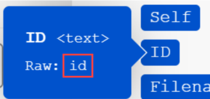

# Asignar una matriz o elemento de matriz

Una matriz es un elemento de paquete que puede contener lo siguiente:

* Uno o más valores del mismo tipo (matriz simple)
* Una o más colecciones del mismo tipo (matriz compleja)

>[!BEGINSHADEBOX]

**Ejemplo:**

* **Matriz compleja**: El módulo [!UICONTROL Ver correos electrónicos] devuelve una matriz de archivos adjuntos para cada correo electrónico. Cada archivo adjunto representa una colección que puede contener un nombre, contenido, tamaño, etc.

>[!ENDSHADEBOX]

## Requisitos de acceso

+++ Expanda para ver los requisitos de acceso para la funcionalidad en este artículo.

Para utilizar la funcionalidad de este artículo debe tener el siguiente acceso:

<table style="table-layout:auto">
 <col> 
 <col> 
 <tbody> 
  <tr> 
   <td role="rowheader">paquete de Adobe Workfront</td> 
   <td> 
Cualquiera
 </td> 
  </tr> 
  <tr data-mc-conditions=""> 
   <td role="rowheader">Licencia de Adobe Workfront</td> 
   <td> 
Nuevo: estándar

O

Actual: [!UICONTROL Work] o superior
 </td> 
  </tr> 
  <tr> 
   <td role="rowheader">Licencia de Adobe Workfront Fusion**</td> 
   <td>
   
Actual: no se requiere licencia de Workfront Fusion.

   
O

   
Heredado: cualquiera 

   </td> 
  </tr> 
  <tr> 
   <td role="rowheader">Producto</td> 
   <td>
   
Nuevo:
 <ul><li>Plan de Workfront de [!UICONTROL Select] o [!UICONTROL Prime]: su organización debe adquirir Adobe Workfront Fusion.</li><li>Plan de Workfront de [!UICONTROL Ultimate]: Workfront Fusion está incluido.</li></ul>
   
O

   
Actual: Su organización debe comprar Adobe Workfront Fusion.

   </td> 
  </tr>
 </tbody> 
</table>

Para obtener más información sobre esta tabla, consulte [Requisitos de acceso en la documentación](/help/workfront-fusion/references/licenses-and-roles/access-level-requirements-in-documentation.md).

Para obtener información sobre las licencias de Adobe Workfront Fusion, consulte [licencias de Adobe Workfront Fusion](/help/workfront-fusion/set-up-and-manage-workfront-fusion/licensing-operations-overview/license-automation-vs-integration.md).

+++

## Asignar una matriz completa

1. Haga clic en la ficha **[!UICONTROL Escenarios]** en el panel izquierdo.
1. Seleccione el escenario en el que desea asignar una matriz.
1. Haga clic en cualquier lugar del escenario para introducir el Editor de escenarios.
1. En el módulo al que desee asignar la matriz, haga clic en el campo donde desee asignar la matriz. Este es el campo al que está asignada la matriz.

1. En el cuadro que aparece, asigne el elemento.

   El panel le permite asignar campos del mismo modo que con cualquier otro tipo de elemento. Si no desea rellenar cada elemento por separado, pero desea asignar otra matriz al campo de destino, utilice el botón [!UICONTROL Asignar]. En este caso, asegúrese de que ambas matrices (la matriz de origen y la de destino) tienen la misma estructura.

   Puede añadir cualquier número de elementos a una matriz.

Puede dividir una matriz en paquetes individuales mediante un iterador. Para obtener más información, consulte el módulo [[!UICONTROL Iterator] en Adobe Workfront Fusion](/help/workfront-fusion/references/modules/iterator-module.md).

## Asignar elementos a una nueva matriz

Algunos campos de Workfront Fusion permiten asignar elementos a una matriz. Por ejemplo, puede crear una matriz de elementos de lista de comprobación en el módulo Tableros de Workfront > Agregar elemento de lista de comprobación. Cuando se ejecuta el módulo, todos los elementos de la lista de comprobación se añaden a la tarjeta.

Cualquier campo de módulo que muestre &quot;Agregar elemento&quot; crea una matriz.

Para agregar elementos a la matriz:

1. Haga clic en **Agregar elemento**
1. En el panel que se abre, escriba detalles sobre el elemento.
1. Haga clic en **Add**.
1. (Opcional) Repita los pasos del 1 al 3 con cada elemento que desee agregar a la matriz .

## Asignar elementos de matriz

### Asignar elementos de matriz por número

Los elementos de la matriz se muestran como un número entre corchetes después del nombre de la matriz. Puede asignar un elemento individual de una matriz a un campo utilizando este número de índice.

>[!NOTE]
>
>La indexación de matrices en Workfront Fusion comienza desde 1.

Para asignar un elemento de matriz:

1. Haga clic en el campo donde desee asignar el elemento.

   Se abrirá el panel de asignación.

1. Busque la matriz que contiene el elemento que desea asignar.
1. Haga clic en la flecha desplegable situada junto a la matriz.
1. Haga clic en el elemento que desee asignar.

   El elemento se asigna con el índice de 1. Esto asigna el primer elemento de la matriz.

1. Para asignar un elemento diferente de la matriz, haga clic en [1] e introduzca el número de índice del elemento de matriz que desea asignar.

   

### Asignar un elemento de una matriz con una clave determinada

Algunas matrices contienen colecciones con elementos clave-valor como metadatos, atributos, etc. Para utilizar uno de estos valores, puede buscar un elemento por su valor clave dado y obtener el valor correspondiente del elemento de valor. Se recomienda utilizar una fórmula que emplee una combinación de las funciones `map()` y `get()`.

>[!BEGINSHADEBOX]

En el siguiente ejemplo se muestra el resultado de la aplicación [!DNL Jira].

Este ejemplo obtiene un nombre de archivo de una matriz de archivos adjuntos, para el archivo adjunto específico con un ID de 10108.

Este ejemplo genera el siguiente resultado:

La fórmula se puede explicar de la siguiente manera:

* `map`

   1. El primer parámetro de la función `map()` es todo el elemento de matriz.
   1. El segundo parámetro es el nombre sin procesar del elemento de valor. Para obtener el nombre sin procesar, pase el puntero por encima del elemento del panel de [!UICONTROL asignación]:

      

      >[!NOTE]
      >
      >Todos los parámetros distinguen entre mayúsculas y minúsculas. Aunque en este ejemplo concreto la etiqueta del elemento difiere de su nombre sin procesar solo en mayúsculas, es necesario utilizar el nombre sin procesar.

   1. El tercer parámetro es el nombre sin procesar del elemento clave:

      

   1. El cuarto parámetro es el valor de clave dado.

  Dado que la función `map()` devuelve una matriz (ya que podría haber más elementos con el valor de la clave especificada), es necesario aplicar la función `get()` para obtener su primer elemento:

* `get`

   1. El primer parámetro de la función `get()` es el resultado de la función `map()`.

   1. El segundo parámetro es el índice del elemento. En este ejemplo, el índice es `1`.

Este ejemplo genera el siguiente resultado:

>[!ENDSHADEBOX]

Para obtener más información acerca de la función `map()`, vea [Funciones de matriz](/help/workfront-fusion/references/mapping-panel/functions/array-functions.md).

Para obtener más información acerca de la función `get()`, vea [Funciones generales](/help/workfront-fusion/references/mapping-panel/functions/general-functions.md).

## Conversión de elementos de matriz en una serie de paquetes

Las matrices se pueden convertir en una serie de paquetes mediante el módulo [!UICONTROL Repetidor]. Para obtener más información, consulte [[!UICONTROL Iterator] module](/help/workfront-fusion/references/modules/iterator-module.md).

