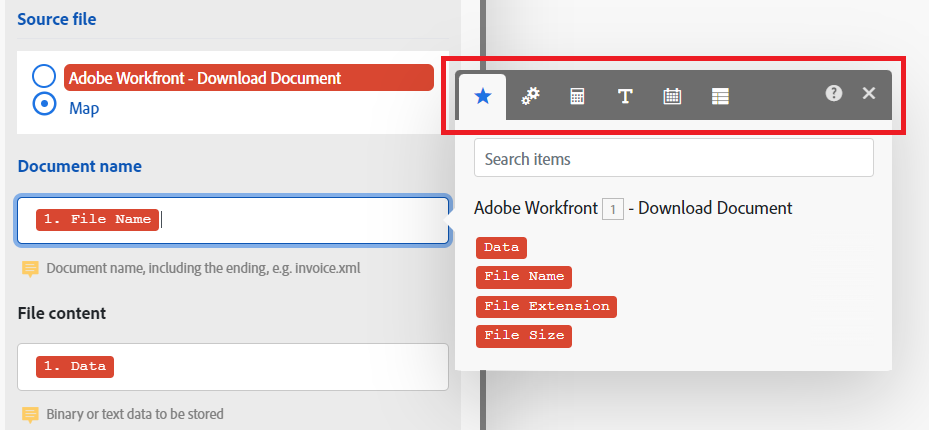

# Información general sobre la función

Workfront Fusion incluye funciones integradas que le permiten crear fórmulas simples o complejas. Estas funciones abarcan una amplia variedad de casos de uso, incluidas las funciones para matrices, cadenas, números y datos de módulos anteriores.

Además, puede crear funciones personalizadas que los escenarios pueden utilizar para transformar y manipular los datos.

## Funciones integradas

Al asignar elementos, puede utilizar funciones para crear fórmulas simples o complejas. Las funciones disponibles son similares a las funciones de Excel y de algunos lenguajes de programación:

* Evalúan la lógica general, las matemáticas, el texto, las fechas y las matrices.
* Permiten realizar lógica condicional y transformaciones de los valores de los elementos, como convertir un texto a mayúsculas, recortar texto, convertir una fecha a un formato diferente y mucho más.

### Información general sobre la pestaña Función

El panel de asignación incluye las siguientes pestañas. Cada pestaña incluye funciones y palabras clave para ese tipo de datos.

| Tipo de funciones | Para obtener más información, consulte lo siguiente: |
| --- | --- |
| **Asignar desde otros módulos**  | [Asignar información de un módulo a otro](/help/workfront-fusion/create-scenarios/map-data/map-data-from-one-to-another.md) |
| **Funciones generales**  | [Funciones generales](/help/workfront-fusion/references/mapping-panel/functions/general-functions.md) |
| **Funciones matemáticas**  | [Funciones matemáticas](/help/workfront-fusion/references/mapping-panel/functions/math-functions.md) |
| **Funciones de texto y binarias**  | [Funciones de cadena](/help/workfront-fusion/references/mapping-panel/functions/string-functions.md) |
| **Fecha y hora**    | <ul><li>[Función de fecha y hora](/help/workfront-fusion/references/mapping-panel/functions/date-and-time-functions.md)</li><li>[Tókenes para el formato de fecha y hora](/help/workfront-fusion/references/mapping-panel/functions/tokens-for-date-and-time-formatting.md)</li><li> [Tókenes para el análisis de fecha y hora](/help/workfront-fusion/references/mapping-panel/functions/tokens-for-date-and-time-parsing.md)</li></ul> |
| **Funciones para trabajar con matrices**   | [Funciones de matriz](/help/workfront-fusion/references/mapping-panel/functions/array-functions.md) |

## Funciones personalizadas

Puede crear funciones personalizadas en el área Funciones de Fusion. A continuación, agregue estas funciones a sus escenarios en forma de módulo de Adobe App Builder.

Dado que las funciones personalizadas funcionan a través de Adobe App Builder, su organización debe tener una licencia de Adobe App Builder para utilizarlas.

Para obtener información e instrucciones sobre las funciones personalizadas, consulte Asignar datos mediante funciones personalizadas.
