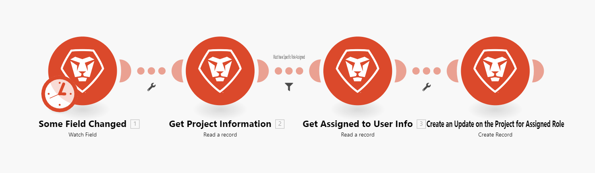

# Información general sobre los escenarios

La función de Adobe Workfront Fusion es automatizar sus procesos para que los usuarios no tengan que dedicar tanto tiempo a tareas rutinarias. Funciona vinculando acciones dentro de las aplicaciones y servicios y entre ellos para crear un escenario que transfiera y transforme los datos automáticamente. El escenario que crea ve los datos de una aplicación o servicio y los procesa para proporcionar el resultado deseado.

Un escenario se compone de una serie de módulos que indican cómo se deben transformar los datos dentro de una aplicación o transferirse entre aplicaciones y servicios web.

## Información general sobre los elementos del escenario

Un escenario se compone de diferentes elementos. Entender la terminología de esos elementos facilita el uso de la documentación.

* [Escenario](#scenario)
* [Activador](#trigger)
* [Módulo](#module)
* [Ruta](#route)
* [Segmento de escenario](#scenario-segment)
* [Conector](#connector)

### Escenario

Un **escenario** es una serie de pasos automatizados creados por el usuario para mover y manipular datos. El término “escenario” hace referencia a todo el grupo de pasos conectados.

### Activador

Un escenario comienza con un **activador**. El activador supervisa los datos nuevos y actualizados e inicia el escenario cuando se aplican determinadas condiciones configuradas en el módulo. Los activadores se pueden configurar para que inicie un escenario según una programación (sondeo) o siempre que se produzcan cambios en los datos (instantáneo).

### Módulo

El activador va seguido de una serie de **módulos**. Un módulo representa un solo paso en un escenario que realiza una acción específica. Los módulos se configuran y se encadenan conjuntamente para crear escenarios.

### Ruta

Un escenario se puede dividir en **rutas**. Una ruta es una sección del escenario que puede utilizarse o no para un conjunto determinado de datos. Las rutas se configuran mediante un módulo de enrutador y filtros.

### Segmento de escenario

Un segmento de escenario es una sección de un escenario que consta de una serie de módulos contiguos que se conectan todos a la misma aplicación. Los segmentos de escenario suelen representar un flujo de trabajo corto en la aplicación.

### Conector

Un conector es el conjunto de módulos de una aplicación determinada. Workfront Fusion ofrece conectores a muchas aplicaciones de trabajo comunes, como Workfront, Salesforce y Jira, así como conectores genéricos que se pueden utilizar para cualquier servicio web.

## Ejemplos

Expanda las siguientes secciones para ver ejemplos de escenarios y sus explicaciones.

+++**Automatización de procesos en Adobe Workfront**

Workfront Fusion le permite automatizar flujos de trabajo simples o complejos en Workfront, lo que ahorra tiempo y garantiza que el proceso se ejecute de manera coherente.

En este ejemplo, el escenario se activa cuando un campo especificado cambia en una tarea o problema en Workfront. Cuando se activa, el escenario obtiene información del proyecto relacionado y crea una actualización adaptada para una persona asignada a una función específica en el proyecto.

+++

+++**Conexión de Workfront a otra aplicación o servicio web**

>[!NOTE]
>
>Si su organización utiliza el modelo de licencias heredado, su organización debe tener una licencia de Workfront Fusion para la automatización e integración de trabajo para conectarse a otras aplicaciones.

Workfront Fusion puede conectarse a otras aplicaciones y servicios web. Puede acceder, importar, manipular o exportar datos de otras aplicaciones, integrándolos con Workfront o entre sí. 

Muchas aplicaciones tienen conectores de Workfront Fusion dedicados. Si no hay ningún conector dedicado para la aplicación a la que desee acceder, puede usar los módulos HTTP o SOAP de Workfront Fusion para conectarse a la aplicación a través de su API.

En este ejemplo, el escenario se activa cuando se añade un usuario a una hoja de cálculo de [!DNL Excel]. El escenario comprueba si el usuario está en Workfront. Si no es así, el escenario creará el usuario en Workfront y volverá a añadir su ID de usuario de Workfront a la hoja de cálculo.

Para obtener una lista de conectores dedicados, consulte [Aplicaciones de Fusion y referencias de sus módulos: índice de artículos](/help/workfront-fusion/references/apps-and-modules/apps-and-modules-toc.md).

>[!IMPORTANT]
>
>Adobe Workfront Fusion puede conectarse a casi cualquier servicio web. Si la aplicación con la que desea trabajar no tiene un conector de Workfront Fusion dedicado, puede utilizar los siguientes conectores universales para conectarse a la aplicación o el servicio.
>
>Para obtener una lista de conectores universales, consulte [Conectores universales](/help/workfront-fusion/references/apps-and-modules/apps-and-modules-toc.md#universal-connectors)

+++

## Referencias

* Para ver un glosario de los términos utilizados en Workfront Fusion, consulte [Glosario de Adobe Workfront Fusion](/help/workfront-fusion/get-started-with-fusion/understand-fusion/fusion-glossary.md).
* Para empezar a crear un escenario práctico, consulte [Crear un escenario básico](/help/workfront-fusion/build-practice-scenarios/create-basic-scenario.md).
* Para obtener información sobre la creación y administración de escenarios, consulte los artículos que se enumeran en:
   * [Crear escenarios](/help/workfront-fusion/create-scenarios/create-scenarios-toc.md)
   * [Administrar escenarios](/help/workfront-fusion/manage-scenarios/manage-scenarios-toc.md)
