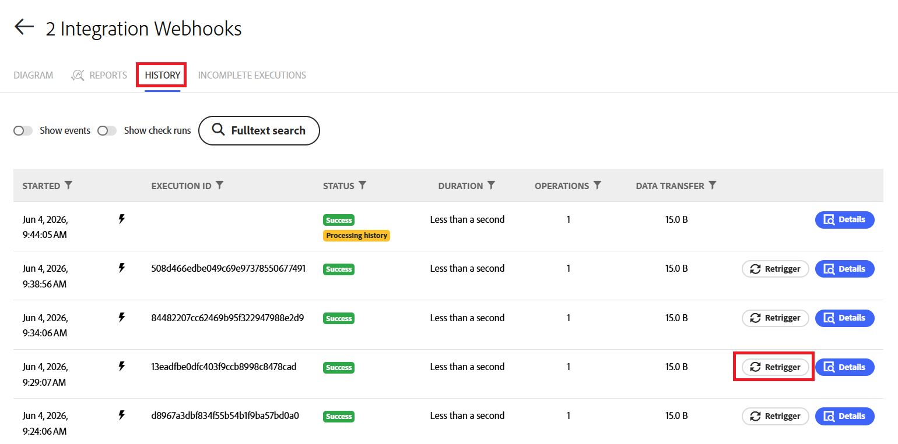

# Recuperación de la ejecución de un escenario específico

Puede recuperar una ejecución de escenario específica para procesar los datos mediante un modelo de escenario actualizado o para ver su flujo de datos. Cuando se vuelve a iniciar una ejecución, el escenario se ejecuta utilizando los datos de esa ejecución.

Por ejemplo, si actualiza un escenario para agregar una acción como crear un problema, puede volver a activar una ejecución que se produjo antes de la actualización. El escenario actualizado se ejecutará con el evento de activación del escenario original, pero incluirá la acción actualizada. En este ejemplo, el escenario crea un problema como parte de la nueva ejecución.

La recuperación está disponible para escenarios que tienen déclencheur de gancho web y para escenarios secundarios.

Al volver a activar un escenario que utiliza un gancho web, el evento original del gancho web se puede utilizar de nuevo, por lo que no tiene que volver a crear el evento para volver a activar el escenario.

Cuando se utilizan escenarios encadenados, la recuperación también se puede aplicar a un escenario secundario. El escenario secundario se puede recuperar utilizando los datos enviados desde el escenario principal en la ejecución original, sin recuperar el escenario principal.

Para obtener más información sobre los webhooks, consulte [Activadores instantáneos (webhooks)](/help/workfront-fusion/references/modules/webhooks-reference.md).

Para obtener más información sobre cómo encadenar escenarios, vea [Encadenar varios escenarios](/help/workfront-fusion/create-scenarios/plan-a-scenario/chain-scenarios.md).

## Requisitos de acceso

+++ Expanda para ver los requisitos de acceso para la funcionalidad en este artículo.

<table style="table-layout:auto">
 <col> 
 <col> 
 <tbody> 
  <tr> 
   <td role="rowheader">Paquete de Adobe Workfront</td> 
   <td> 
Cualquier paquete del flujo de trabajo de Adobe Workfront y cualquier paquete de integración y automatización de Adobe Workfront

Workfront Ultimate

Paquetes Workfront Prime y Select, con una compra adicional de Workfront Fusion.
 </td> 
  </tr> 
  <tr data-mc-conditions=""> 
   <td role="rowheader">Licencias de Adobe Workfront</td> 
   <td> 
Estándar

Trabajo o superior
 </td> 
  </tr> 
  <tr> 
   <td role="rowheader">Producto</td> 
   <td>
   
Si su organización tiene un paquete de Workfront Select o Prime que no incluye la automatización y la integración de Workfront, su organización debe adquirir Adobe Workfront Fusion.</li></ul>
   </td> 
  </tr>
 </tbody> 
</table>

Para obtener más información sobre el contenido de esta tabla, consulte [Requisitos de acceso en la documentación](/help/workfront-fusion/references/licenses-and-roles/access-level-requirements-in-documentation.md).

+++

## Recuperación de una ejecución

Puede recuperar la ejecución de un escenario desde el Diagrama del escenario, el área Historial del escenario o la página de ejecución del escenario específico.

### Recuperar una ejecución desde el diagrama de escenario

1. Haga clic en la ficha **[!UICONTROL Escenarios]** en el panel izquierdo.
1. Seleccione el escenario que ejecutó la ejecución que desea volver a activar.

   Se abre el diagrama del escenario.
1. Busque la ejecución que desea volver a activar en la lista Ejecuciones del lado derecho de la página.
1. Haga clic en **Recuperador** para ese escenario.

### Recuperación de una ejecución desde el historial del escenario

1. Haga clic en la ficha **[!UICONTROL Escenarios]** en el panel izquierdo.
1. Seleccione el escenario que ejecutó la ejecución que desea volver a activar.

   Se abre el diagrama del escenario.

1. Haga clic en la ficha **Historial** justo debajo del nombre del escenario.
1. Busque la ejecución que desea volver a activar. Puede utilizar la búsqueda de texto completo para localizarla si es necesario.
1. Haga clic en **Recuperador** para ese escenario.

### Recuperar un escenario desde la página de ejecución del escenario

1. Haga clic en la ficha **[!UICONTROL Escenarios]** en el panel izquierdo.
1. Seleccione el escenario que ejecutó la ejecución que desea volver a activar.

   Se abre el diagrama del escenario.
1. Busque la ejecución que desea volver a activar en la lista Ejecuciones del lado derecho de la página.
1. Haga clic en la ejecución para abrirla.
1. En la página de ejecución, haga clic en **Recuperador**.

