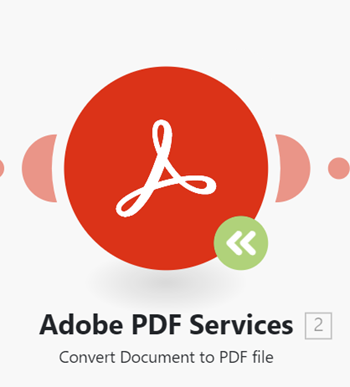

# Actualización de un módulo a una nueva versión

Dado que las aplicaciones a las que se conecta Workfront Fusion pueden actualizar o lanzar nuevas versiones, a veces es necesario que Fusion lance módulos actualizados para esas aplicaciones.

Si ve un icono verde del módulo de actualización en un módulo en un escenario, significa que Workfront Fusion ha lanzado una nueva versión de ese módulo.

Puede actualizar el módulo sin crear un nuevo escenario.

## Requisitos de acceso

+++ Expanda para ver los requisitos de acceso para la funcionalidad en este artículo.

<table style="table-layout:auto">
 <col> 
 <col> 
 <tbody> 
  <tr> 
   <td role="rowheader">paquete de Adobe Workfront</td> 
   <td> 
Cualquier paquete de flujo de trabajo de Adobe Workfront y cualquier paquete de integración y automatización de Adobe Workfront

Workfront Ultimate

Paquetes Workfront Prime y Select, con una compra adicional de Workfront Fusion.
 </td> 
  </tr> 
  <tr data-mc-conditions=""> 
   <td role="rowheader">Licencias de Adobe Workfront</td> 
   <td> 
Estándar

Trabajo o superior
 </td> 
  </tr> 
  <tr> 
   <td role="rowheader">Producto</td> 
   <td>
   
Si su organización tiene un paquete Select o Prime Workfront que no incluye la automatización y la integración de Workfront, su organización debe adquirir Adobe Workfront Fusion.</li></ul>
   </td> 
  </tr>
 </tbody> 
</table>

Para obtener más información sobre esta tabla, consulte [Requisitos de acceso en la documentación](/help/workfront-fusion/references/licenses-and-roles/access-level-requirements-in-documentation.md).

+++

## Actualización de un módulo de Workfront a una nueva versión

1. Haga clic en el icono **Actualizar módulo**  del módulo en el que desee actualizar a una nueva versión.
   
1. Seleccione una de las siguientes opciones:

   * Para seleccionar un módulo nuevo que reemplace este módulo (en lugar de actualizar el módulo), haga clic en **Elegir nuevo** y continúe como se describe en [Actualizar un módulo que no sea de Workfront a una nueva versión](#upgrade-a-non-workfront-module-to-a-new-version).
   * Para actualizar solo este módulo, conservando la configuración del módulo, haga clic en **Actualizar**.
   * Para actualizar todos los módulos de Workfront en el escenario, haga clic en **Actualizar todo**.

1. Guarde el escenario.

>[!NOTE]
>
>Si ha actualizado los módulos de Workfront, le recomendamos que los abra y compruebe la configuración del módulo.

## Actualización de un módulo que no sea de Workfront a una nueva versión

1. Haga clic en el icono **Actualizar módulo**  del módulo en el que desee actualizar a una nueva versión.
   
1. Haga clic en **Elegir nuevo**.
1. Seleccione el módulo que desea reemplazar al módulo anterior.
1. Configure el módulo con los mismos ajustes que el módulo existente.
1. Conecte el módulo nuevo al escenario en el mismo lugar que el módulo existente.
1. Elimine el módulo antiguo.
1. Guarde el escenario.
