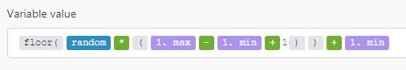

# Variables matemáticas

## pi

Representa el símbolo matemático $\pi$.

## [!UICONTROL random]

Devuelve un número pseudoaleatorio de coma flotante en el rango [`0`,`1`] (que incluye `0`, pero no `1`).

Utilice la siguiente fórmula para generar un número pseudoaleatorio entero en el rango [`min`,`max`] (que incluye `min` y `max`):



```
floor(random * (1.max - 1.min + 1)) + 1.min
```
