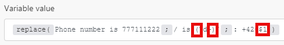

# Funciones de cadena

## [!UICONTROL length (text or buffer)]

Devuelve la longitud de la cadena de texto (número de caracteres) o del búfer binario (tamaño del búfer en bytes).

>[!BEGINSHADEBOX]

 **Ejemplo:**

`length( hello )`

Devuelve: 5

>[!ENDSHADEBOX]

## [!UICONTROL lower (text)]

Convierte a minúsculas todos los caracteres alfabéticos de una cadena de texto.

>[!BEGINSHADEBOX]

**Ejemplo:**

`lower( Hello )`

Devuelve: hello

>[!ENDSHADEBOX]

## [!UICONTROL capitalize (text)]

Convierte el primer carácter de una cadena de texto en mayúscula.

>[!BEGINSHADEBOX]

**Ejemplo:**

`capitalize( workfront )`

Devuelve: [!DNL Workfront]

>[!ENDSHADEBOX]

## [!UICONTROL startcase (text)]

Pone en mayúscula la primera letra de cada palabra y en minúsculas todas las demás letras.

>[!BEGINSHADEBOX]

**Ejemplo:**
`startcase( hello WORLD )`

Devuelve: [!UICONTROL Hello World]

>[!ENDSHADEBOX]

## [!UICONTROL ascii (text; [remove diacritics])]

Quita todos los caracteres que no sean ascii de una cadena de texto.

>[!BEGINSHADEBOX]

**Ejemplos:**

* `ascii(` `Wěošrčkřfžrýoáníté` `)`

Devuelve: [!DNL Workfront]

* `ascii(` `ěščřž` `;` `true` `)`

Devuelve: [!UICONTROL escrz]

>[!ENDSHADEBOX]

## [!UICONTROL replace (text;search string; replacement string)]

Reemplaza la cadena de búsqueda por la nueva cadena.

>[!BEGINSHADEBOX]

**Ejemplo:**

`replace( Hello World ; Hello ; Hi )`

Devuelve: [!UICONTROL Hi World]

>[!ENDSHADEBOX]

Las expresiones regulares (entre `/.../`) se pueden usar como cadena de búsqueda con una combinación de indicadores (como `g`, `i`, `m`) anexados:

>[!BEGINSHADEBOX]

**Ejemplo:**

Todos estos números X X X X se sustituyen por X

>[!ENDSHADEBOX]

La cadena de reemplazo puede incluir los siguientes patrones de reemplazo especiales:

* `$&` Inserta la subcadena coincidente.
* `$n` Donde n es un entero positivo menor que 100, inserta la enésima cadena de subcoincidencias entre paréntesis. Se indexa en 1.

>[!BEGINSHADEBOX]

**Ejemplos:**

Devuelve: número de teléfono `+420777111222`

Devuelve: número de teléfono: `+420777111222`

>[!CAUTION]
>
>No utilice grupos de captura con nombre como `/ is (?<number>\d+)/` en el argumento de cadena de reemplazo. Al hacerlo, se produce un error.

>[!ENDSHADEBOX]

Para obtener más información sobre las expresiones regulares, consulte [Analizador de texto](/help/workfront-fusion/references/apps-and-modules/tools-and-transformers/text-parser.md).

## [!UICONTROL trim (text)]

Quita los caracteres de espacio al principio o al final del texto.

## [!UICONTROL upper (text)]

Convierte todos los caracteres alfabéticos de una cadena de texto a mayúsculas.

>[!BEGINSHADEBOX]

**Ejemplo:**

`upper( Hello )`

Devuelve: [!UICONTROL HELLO]

>[!ENDSHADEBOX]

## [!UICONTROL substring (text; start;end)]

Devuelve una parte de una cadena de texto entre la posición “inicial” y “final”.

>[!BEGINSHADEBOX]

**Ejemplos:**

* `substring( Hello ; 0 ; 3)`

  Devuelve: Hel

* `substring( Hello ; 1 ; 3 )`

  Devuelve: el

>[!ENDSHADEBOX]

## [!DNL indexOf (string; value; [start])]

Devuelve la posición de la primera aparición de un valor especificado en una cadena. Este método devuelve &#39;-1&#39; si el valor que se busca no está allí. El valor inicial indica en qué punto de la cadena debe comenzar la búsqueda.

>[!BEGINSHADEBOX]

**Ejemplos:**

* `indexOf( Workfront ; o )`

  Devuelve: 1

* `indexOf( Workfront ; x )`

  Devuelve: -1

* `indexOf( Workfront ; o ; 3 )`

  Devuelve: 6

>[!ENDSHADEBOX]

## [!UICONTROL toBinary (value)]

Convierte cualquier valor en datos binarios.

También puede especificar la codificación como un segundo argumento para aplicar conversiones binarias de hex o base64 a datos binarios.

>[!BEGINSHADEBOX]

**Ejemplos:**

* `toBinary( Workfront )`

  Devuelve: 57 6f 72 6b 66 72 6f 6e 74

* `toBinary( V29ya2Zyb250 ; base64 )`

  Devuelve: 57 6f 72 6b 66 72 6f 6e 74

>[!ENDSHADEBOX]

## [!UICONTROL toString (value)]

Convierte cualquier valor en una cadena.

## [!UICONTROL encodeURL (text)]

Codifica los caracteres especiales de algún texto en una dirección URL válida.

## [!UICONTROL decodeURL (text)]

Decodifica los caracteres especiales de una dirección URL en texto.

>[!BEGINSHADEBOX]

**Ejemplo:**
`decodeURL( Automate%20your%20workflow )`

Devuelve: [!UICONTROL Automate your workflow]

>[!ENDSHADEBOX]

## [!UICONTROL escapeHTML (text)]

Excluye todas las etiquetas de HTML del texto.

>[!BEGINSHADEBOX]

**Ejemplo:**

`escapeHTML( <b>Hello</b> )`

Devuelve: `&lt;b&gt;Hello&lt;/b&gt;`

>[!ENDSHADEBOX]

## [!UICONTROL escapeMarkdown(text)]

Excluye todas las etiquetas Markdown del texto.

>[!BEGINSHADEBOX]

**Ejemplo:**

`escapeMarkdown( # Header )`

Devuelve: `&#35; Header`

>[!ENDSHADEBOX]

## [!UICONTROL stripHTML (text)]

Quita todas las etiquetas HTML del texto.

>[!BEGINSHADEBOX]

**Ejemplo:**

`stripHTML( <b>Hello</b> )`

Devuelve: hello

>[!ENDSHADEBOX]

## contiene (texto; cadena de búsqueda)

Comprueba si el texto contiene la cadena de búsqueda.

>[!BEGINSHADEBOX]

**Ejemplos:**

* `contains( Hello World ; Hello )`

  Devuelve: [!UICONTROL true]

* `contains( Hello World ; Bye )`

  Devuelve: [!UICONTROL false]

>[!ENDSHADEBOX]

## [!UICONTROL split (text; separator)]

Divide una cadena en una matriz de cadenas separando la cadena en subcadenas.

>[!BEGINSHADEBOX]

**Ejemplo:**

`split( John, George, Paul ; , )`

>[!ENDSHADEBOX]

## [!UICONTROL md5 (text)]

Calcula el hash md5 de una cadena.

>[!BEGINSHADEBOX]

**Ejemplo:**

`md5( Workfront )`

Devuelve: `1448bbbeaa7a9b8091d426999f1f666b`

>[!ENDSHADEBOX]

## [!UICONTROL sha1 (text; [encoding]; [key])]

Calcula el hash sha1 de una cadena. Si se especifica el argumento clave, se devuelve un hash HMAC sha1 en su lugar. Codificaciones compatibles: &quot;hex&quot; (predeterminado), &quot;base64&quot; o &quot;latin1&quot;.

>[!BEGINSHADEBOX]

**Ejemplo:**

`sha1( workfront )`

Devuelve: b2b30b8ae1f9e5b40fbb0696eaabdbfd8d0c087f

>[!ENDSHADEBOX]

## [!UICONTROL sha256 (text; [encoding]; [key])]

Calcula el hash sha256 de una cadena. Si se especifica el argumento clave, se devuelve un hash sha256 HMAC en su lugar. Codificaciones compatibles: &quot;hex&quot; (predeterminado), &quot;base64&quot; o &quot;latin1&quot;.>

>[!BEGINSHADEBOX]

**Ejemplo:**

`sha256( workfront )`

Devuelve: ed3d7397eec7b94453035b67ba4468c883ee3bedeb57137f7371f2e0cf5e2bbc

>[!ENDSHADEBOX]

## [!UICONTROL sha512 (text; [output encoding]; [key]; [key encoding])]

Calcula el hash sha512 de una cadena. Si se especifica el argumento clave, se devuelve un hash HMAC sha512 en su lugar.

Codificaciones compatibles:

* &quot;[!UICONTROL hex]&quot; (predeterminado)
* &quot;[!UICONTROL base64]&quot;
* &quot;[!UICONTROL latin1]&quot;

Codificaciones de claves compatibles:

* &quot;[!UICONTROL text]&quot; (predeterminado)
* &quot;[!UICONTROL hex]&quot;
* &quot;[!UICONTROL base64]&quot; o &quot;[!UICONTROL binary]&quot;

Al utilizar la codificación de claves &quot;[!UICONTROL binary]&quot;, una clave debe ser un búfer, no una cadena.

>[!BEGINSHADEBOX]

**Ejemplo:**

`sha512(workfront)`

Devuelve: 789ae41b9456357e4f27c6a09956a767abbb8d80b206003ffdd1e94dbc687cd119b85e1e19db58bb44b234493af35fd431639c0345aadf2cf7ec26e9f4a7fb11 9

>[!ENDSHADEBOX]

## [!UICONTROL base64 (text)]

Transforma el texto en base64.

>[!BEGINSHADEBOX]

**Ejemplo:**

`base64( workfront )`

Devuelve: d29ya2Zyb250==

>[!ENDSHADEBOX]
