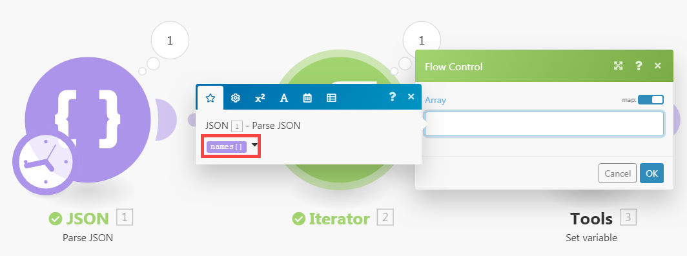
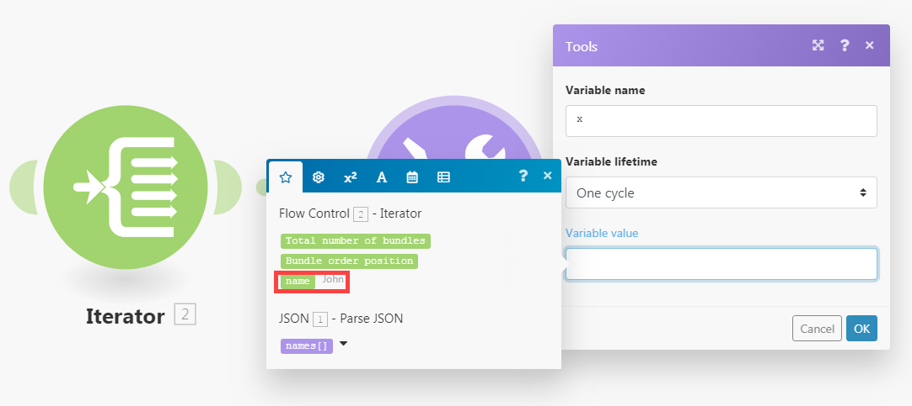

# [!UICONTROL Iterator] módulo

Un [!UICONTROL Iterator] es un tipo de módulo que convierte una matriz en una serie de paquetes. Cada elemento de matriz se presenta como un paquete independiente.

## Requisitos de acceso

+++ Expanda para ver los requisitos de acceso para la funcionalidad en este artículo.

Para utilizar la funcionalidad de este artículo debe tener el siguiente acceso:

<table style="table-layout:auto">
 <col> 
 <col> 
 <tbody> 
  <tr> 
    <td role="rowheader">[!DNL Adobe Workfront] paquete</td> 
   <td> 
Cualquiera
 </td> 
  </tr> 
  <tr data-mc-conditions=""> 
   <td role="rowheader">[!DNL Adobe Workfront] licencia</td> 
   <td> Nuevo: estándar
O

Actual: Trabajo o superior
 </td> 
  </tr> 
  <tr> 
   <td role="rowheader">[!UICONTROL Adobe Workfront Fusion] licencia</td> 
   <td>
   
Actual: no se requiere licencia para [!DNL Workfront Fusion].

   
O

   
Heredado: cualquiera 

   </td> 
  </tr> 
  <tr> 
   <td role="rowheader">Producto</td> 
   <td>
   
Nuevo:
 <ul><li>[!UICONTROL Select] o plan [!UICONTROL Prime] [!DNL Workfront]: su organización debe comprar [!DNL Adobe Workfront Fusion].</li><li>[!UICONTROL Ultimate] [!DNL Workfront] plan: [!DNL Workfront Fusion] está incluido.</li></ul>
   
O

   
Actual: su organización debe comprar [!DNL Adobe Workfront Fusion].

   </td> 
  </tr>
 </tbody> 
</table>

Para saber qué plan, tipo de licencia o acceso tiene, póngase en contacto con el administrador de [!DNL Workfront].

Para obtener información sobre las licencias de Adobe Workfront Fusion, consulte [[!DNL Adobe Workfront Fusion] licencias](/help/workfront-fusion/set-up-and-manage-workfront-fusion/licensing-operations-overview/license-automation-vs-integration.md).

+++

## Configuración del módulo [!UICONTROL Iterator]

El módulo Iterator general tiene un solo campo, el campo [!UICONTROL Array]. Este campo contiene la matriz que se va a convertir o dividir en paquetes independientes.

Otros conectores pueden incluir módulos de iterador específicos de ese iterador. Contienen un campo de módulo de Source, que le permite seleccionar el módulo que genera la matriz que desea repetir.

Para obtener más información, consulte [Configurar un módulo](/help/workfront-fusion/create-scenarios/add-modules/configure-a-modules-settings.md).

>[!BEGINSHADEBOX]

**Ejemplos**

* El siguiente escenario muestra cómo recuperar correos electrónicos con archivos adjuntos y guardarlos como archivos únicos en una carpeta [!DNL Dropbox] seleccionada.

  Los correos electrónicos pueden contener una matriz de archivos adjuntos. El módulo [!UICONTROL Iterator] después del primer módulo permite que el escenario administre cada archivo adjunto por separado. El módulo [!UICONTROL Iterator] divide la matriz de archivos adjuntos en paquetes únicos. Cada paquete, con un archivo adjunto, se guarda de uno en uno en una carpeta [!DNL Dropbox] seleccionada. El campo [!UICONTROL Array] del módulo Iterator debe contener la matriz `Attachments`.

  

>[!ENDSHADEBOX]

## Resolución de problemas

### Problema: El panel de asignación no muestra elementos asignables en el módulo [!UICONTROL Iterator]

Cuando un módulo [!UICONTROL Iterator] no tiene información sobre la estructura de los elementos de la matriz, el panel de asignación de los módulos que siguen al módulo [!UICONTROL Iterator] muestra solo dos elementos bajo el módulo [!UICONTROL Iterator]: `Total number of bundles` y `Bundle order position`.

Esto se debe a que cada módulo es responsable de proporcionar información sobre los elementos que genera, de modo que estos elementos se puedan mostrar correctamente en el panel de asignación en los módulos posteriores. Sin embargo, es posible que varios módulos no puedan proporcionar esta información en algunos casos. Por ejemplo, los módulos [!UICONTROL JSON] > [!UICONTROL Parse JSON] o [!UICONTROL Webhooks] > [!UICONTROL Custom Webhook] a los que les falta la estructura de datos no proporcionarían la información.

#### Solución

La solución es ejecutar manualmente el escenario. Esto fuerza al módulo a crear una salida. Fusion puede aplicar el formato de esta salida a módulos posteriores en el escenario.

Por ejemplo, un escenario incluye un módulo [!UICONTROL JSON] > [!UICONTROL Parse JSON] sin una estructura de datos.

Un módulo [!UICONTROL Iterator] conectado a este módulo JSON no puede asignar la salida del módulo al campo Array en el panel de configuración del módulo [!UICONTROL Iterator].

Para resolver esto:

Inicie manualmente el escenario en el editor de escenarios.

>[!NOTE]
>
>Para evitar que se ejecute todo el escenario, puede:
>
>* Desvincule los módulos después del módulo [!UICONTROL JSON] > [!UICONTROL Parse JSON] para evitar que el flujo continúe.
>   O
>* Haga clic con el botón derecho en el módulo [!UICONTROL JSON] > [!UICONTROL Parse JSON] y elija **[!UICONTROL Run this module only]** del menú contextual para ejecutar solo el módulo [!UICONTROL JSON] > [!UICONTROL Parse JSON].

Una vez que se ejecuta [!UICONTROL JSON] > [!UICONTROL Parse JSON], puede proporcionar información sobre sus resultados a todos los módulos subsiguientes, incluido el módulo Iterator. A continuación, el panel de asignación de la configuración del iterador muestra los elementos siguientes:

además, el panel asignación de los módulos conectados después del módulo [!UICONTROL Iterator] muestra los elementos contenidos en la matriz:

