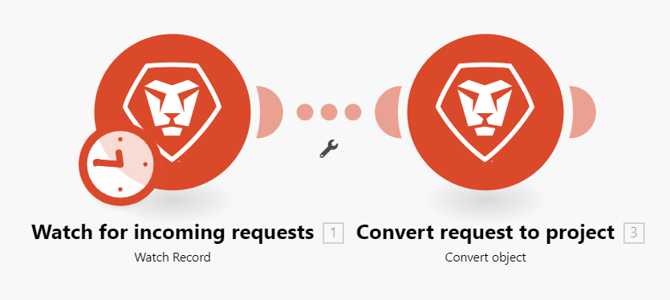

# Flujo de ejecución de escenarios

En este artículo se explica cómo se ejecuta un escenario y cómo fluyen los datos a través de él, y cómo vista los datos procesados por cada módulo.

Para vista cómo fluyen los datos a través de un escenario activo, vea [Ver flujo de datos en un escenario](/help/workfront-fusion/manage-scenarios/view-scenario-data-flow.md) en ejecución.

## Flujo de ejecución de escenarios

Después de configurar y activar un escenario correctamente, se ejecuta de acuerdo con su programación definida.

A medida que comienza el escenario, la primera módulo responde a un evento que se ha configurado para observar. Cuando devuelve datos, esos datos se empaquetan en paquetes. El escenario devuelve un paquete por cada evento. Por ejemplo, si un módulo está configurado para vigilar los problemas, devolverá un paquete de datos por cada problema que encuentre.

Si el módulo desencadenador devuelve paquetes de datos, esos paquetes pasan al siguiente módulo y el escenario continúa, pasando los paquetes a través de cada módulo sucesivo, uno a la vez.

Si los paquetes se procesan correctamente en todos los módulos, el escenario se marca como un éxito en el Página de detalles del escenario.

### Ejemplo: [!UICONTROL [!DNL Workfront Fusion] para la automatización del trabajo]

>[!BEGINSHADEBOX]

**Ejemplo:** en este escenario que vigila las solicitudes [!DNL Workfront] entrantes y luego las convierte en [!DNL Workfront] proyectos, los datos fluirían de la siguiente manera:

El primer paso del escenario, realizado por el primer módulo, es observar las solicitudes. Cada solicitud que encuentra se considera una paquete. Si el módulo se ejecuta sin encontrar ningún paquete, el escenario finaliza después del primer módulo.

Si la primera módulo devuelve un paquete, el paquete pasa por el resto del escenario. En este ejemplo, el paquete iría al segundo módulo, que convierte el solicitud en un proyecto.

>[!ENDSHADEBOX]

### Ejemplo: [!UICONTROL [!DNL Workfront Fusion] para automatización e integración del trabajo]

>[!BEGINSHADEBOX]

**Ejemplo:** en este escenario que descarga documentos y [!DNL Adobe Workfront] las envía a una carpeta en [!DNL Dropbox], los datos fluirían de la siguiente manera:

El primer paso del escenario, realizado por el primer módulo, es observar documentos en Workfront. Cada documento que encuentra se considera una paquete. Si el módulo se ejecuta sin encontrar ningún paquete, el escenario finaliza después del primer módulo.

Si se devuelve un paquete, el paquete pasa por el resto del escenario. En este ejemplo, el resto del escenario consiste en el segundo módulo, que carga el paquete en la [!DNL Dropbox] carpeta.

Si el primer módulo devuelve varios paquetes, el primer paquete se carga [!DNL Dropbox] antes de que se cargue el segundo paquete. Luego se carga el segundo paquete, luego el tercero, y así sucesivamente.

>[!ENDSHADEBOX]

## Información sobre paquetes procesados

Para cada módulo, el paquete pasa por un proceso de 4 pasos antes de pasar al siguiente módulo o llegar a su destino final.

* Inicialización
* Operación
* Commit/Rollback
* Finalización

>[!NOTE]
>
>El escenario más grande también pasa por este proceso. Para obtener información sobre este proceso en el nivel de escenario, vea [Ejecución de escenarios, ciclos y fases](/help/workfront-fusion/references/scenarios/scenario-execution-cycles-phases.md).

Una vez finalizada la ejecución de un escenario, cada módulo muestra un icono que muestra el número de operaciones realizadas. Puede hacer clic en este icono para ver la información detallada sobre los paquetes procesados para cada paso del proceso. Puede ver qué configuración de módulo se ha utilizado y qué paquetes han devuelto cada módulo.

En este ejemplo, el módulo recibió información de entrada como:

* El identificador del problema encontrado
* El objeto en el que se convertirá el problema (proyecto)
* ID de la plantilla que utilizará para crear el proyecto
* El tipo de registro del objeto encontrado (OPTASK, que es un problema)

Después del procesamiento, el módulo devolvió esta información de salida:

* ID del proyecto recién creado.

Si el módulo encontrado más de un problema, la información se captura para cada paquete por separado. Habría un área de Operación 2 con secciones de entrada y salida que describen el segundo paquete, y así sucesivamente.

## Errores al ejecutar un escenario

Puede producirse un error durante la ejecución del escenario. Por ejemplo, si ha eliminado el plantilla que el módulo usará para crear el nuevo proyecto, el escenario termina con un mensaje de error. Para obtener más información acerca de cómo gestionar errores, consulte [Error tipos](/help/workfront-fusion/references/errors/error-processing.md).

## Recursos

* Para obtener más información sobre cómo configurar un escenario, consulte [El escenario editor](/help/workfront-fusion/get-started-with-fusion/navigate-fusion/scenario-editor.md).
* Para obtener más información sobre los detalles del escenario Página, consulte [Detalles](/help/workfront-fusion/get-started-with-fusion/navigate-fusion/scenario-details.md) del escenario.
* Para obtener más información sobre cómo activar un escenario, consulte [Activar o desactivar un escenario](/help/workfront-fusion/manage-scenarios/activate-deactivate-scenarios.md).
* Para obtener más información sobre cómo programar un escenario, vea [Programar un escenario](/help/workfront-fusion/create-scenarios/config-scenarios-settings/schedule-a-scenario.md).
* Para obtener más información sobre los módulos, consulte [Información general](/help/workfront-fusion/get-started-with-fusion/understand-fusion/module-overview.md) sobre módulos.
