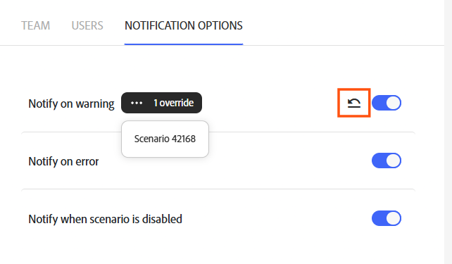

# Definir opciones de notificación

En su organización utiliza el Unified Shell de Adobe, recibirá notificaciones a través del área Notificaciones de Adobe.

Si su organización no se ha migrado al Unified Shell de Adobe, puede elegir las notificaciones que recibe un equipo. Las notificaciones se establecen en el nivel de equipo.

Puede controlar las situaciones para las que se envían notificaciones:

* Notificar al recibir una advertencia: Fusion envía una notificación cuando la ejecución de un escenario registra una advertencia.
* Notificar por error: Fusion envía una notificación cuando falla la ejecución de un escenario.
* Notificar cuando el escenario esté desactivado: Fusion envía una notificación cuando un escenario se desactiva automáticamente, como cuando se producen demasiados errores consecutivos.

Puede establecer notificaciones en el equipo o en el nivel de escenario. Las notificaciones de nivel de escenario anulan las notificaciones establecidas en el nivel de equipo. Es decir, si una configuración de escenario contradice directamente una configuración de equipo, se sigue la configuración de escenario. La configuración de notificaciones del equipo muestra si hay alguna anulación para esa configuración.

De forma predeterminada, todos los tipos de notificaciones están activados en Workfront Fusion.

>[!IMPORTANT]
>
>Para recibir notificaciones de Workfront Fusion, debe tener activadas las notificaciones de Fusion en la configuración de notificaciones de Adobe CX Enterprise. Para acceder a estos ajustes, haga clic en la campana de notificación en la esquina superior derecha de la pantalla y, a continuación, haga clic en el icono de configuración.

## Requisitos de acceso

+++ Expanda para ver los requisitos de acceso para la funcionalidad en este artículo.

<table style="table-layout:auto">
 <col> 
 <col> 
 <tbody> 
  <tr> 
   <td role="rowheader">Paquete de Adobe Workfront</td> 
   <td> 
Cualquier paquete del flujo de trabajo de Adobe Workfront y cualquier paquete de integración y automatización de Adobe Workfront

Workfront Ultimate

Paquetes Workfront Prime y Select, con una compra adicional de Workfront Fusion.
 </td> 
  </tr> 
  <tr data-mc-conditions=""> 
   <td role="rowheader">Licencias de Adobe Workfront</td> 
   <td> 
Estándar

Trabajo o superior
 </td> 
  </tr> 
  <tr> 
   <td role="rowheader">Producto</td> 
   <td>
   
Si su organización tiene un paquete de Workfront Select o Prime que no incluye la automatización y la integración de Workfront, su organización debe adquirir Adobe Workfront Fusion.</li></ul>
   </td> 
  </tr>
  <tr data-mc-conditions=""> 
   <td role="rowheader">Función</td> 
   <td> 
     
Debe ser miembro de la organización y del equipo de Fusion para el que esté ajustando la configuración de las notificaciones.

   </td> 
  </tr> 
 </tbody> 
</table>

Para obtener más información sobre el contenido de esta tabla, consulte [Requisitos de acceso en la documentación](/help/workfront-fusion/references/licenses-and-roles/access-level-requirements-in-documentation.md).

+++

## Ver y administrar la configuración de notificaciones en el nivel de equipo

1. En Workfront Fusion, haga clic en **Resumen del equipo** en el panel de navegación izquierdo.
1. Haga clic en la ficha **Opciones de notificación**.

   Se abre la lista de opciones de Notificación. Si hay alguna anulación, el número de anulaciones aparece junto a esa configuración.

1. (Condicional) Si hay alguna anulación, para ver qué escenarios anulan la configuración de notificación del equipo, haga clic en el menú de tres puntos para esa configuración.

   Puede hacer clic en un escenario en este menú para ir directamente a ese escenario.

   

1. Para restaurar la configuración predeterminada de un tipo de notificación, consulte [Restaurar valores predeterminados de notificación](#restore-notification-defaults) en este artículo.

Los cambios en la lista de opciones de Notificaciones se guardan automáticamente.

## Establecer la configuración de notificaciones en el nivel de escenario

La configuración de notificaciones para escenarios individuales se establece en el panel Configuración de escenarios de ese escenario.

1. Haga clic en la ficha **[!UICONTROL Escenarios]** en el panel izquierdo.
1. Seleccione el escenario en el que desea agregar un filtro.
1. Haga clic en cualquier lugar del escenario para introducir el Editor de escenarios.
1. Haga clic en el icono [!UICONTROL Configuración de escenario]  en la parte inferior del escenario.
1. En el panel Configuración de escenario, haga clic en **Mostrar configuración avanzada** en la parte inferior del panel.
1. Ajuste la configuración de **Notificar con advertencia**, **Notificar con error** y **Notificar cuando el escenario esté deshabilitado** según lo desee.
1. Haga clic en **Aceptar** para guardar y salir de la configuración del escenario.

## Restaurar valores predeterminados de notificación

Puede restaurar una configuración de notificación del equipo a la predeterminada desde la pestaña Opciones de notificación. Esto establece la opción de notificación como habilitada y elimina cualquier anulación de notificación de escenario para ese tipo de notificación.

Si el tipo de notificación está establecido en el valor predeterminado, el icono **Restaurar al valor predeterminado** no estará visible.

1. En Workfront Fusion, haga clic en **Resumen del equipo** en el panel de navegación izquierdo.
1. Haga clic en la ficha **Opciones de notificación**.

   Se abre la lista de opciones de Notificación. Si un tipo de notificación no está establecido actualmente en el valor predeterminado, el icono Restaurar a valor predeterminado estará visible para ese tipo de notificación.

   

1. Para restaurar la configuración predeterminada de ese tipo de notificación, incluidas las anulaciones de escenarios, haga clic en el icono **Restablecer a predeterminado**  para ese tipo de notificación.

Los cambios en la lista de opciones de Notificaciones se guardan automáticamente.

<!--

## Set notification options

If your organization is not on the Adobe Unified Shell, you can set notification settings directly in Fusion.

Email notification options are set on the team level.

1. In the left navigation panel, click **[!UICONTROL Team]**
1. Select the **[!UICONTROL Notification Options]** tab.
1. Enable the notifications that you want the team to receive.

   <table style="table-layout:auto"> 
    <col> 
    <col> 
    <tbody> 
     <tr> 
      <td role="rowheader">'[!UICONTROL Warning in scenario run]'</td> 
      <td> 
Receive an email when there is a warning in a scenario run
 </td> 
     </tr> 
     <tr> 
      <td role="rowheader">[!UICONTROL Errors in scenario run]</td> 
      <td>Receive an email when there is an error in a scenario run.</td> 
     </tr> 
     <tr> 
      <td role="rowheader"> 
[!UICONTROL Scenario deactivation]
 </td> 
      <td>
Receive an email when a scenario deactivates.

In some cases, a scenario might be deactivated by the Workfront Fusion engineering team because the scenario is causing performance or other issues. In these cases, you do not receive notifications in Workfront Fusion. 
</td>

</tr>
</tbody>
</table>

Changes to notification options save automatically.

-->
